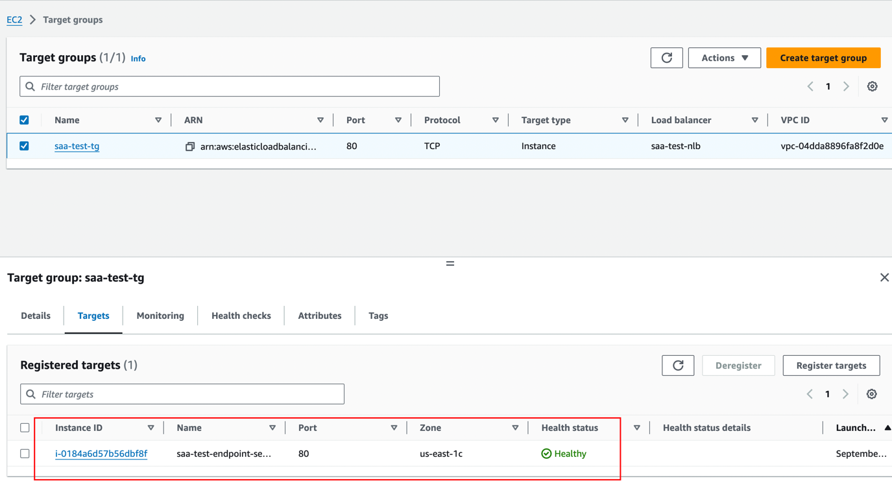

# vpc
## **Amazon VPC（Virtual Private Cloud）详解**

**Amazon Virtual Private Cloud（VPC）** 是AWS中的核心网络服务，允许你在云中定义和控制你自己的**虚拟私有网络**。VPC让你能够在一个隔离的网络环境中运行AWS资源，类似于你自己的本地数据中心。通过VPC，用户可以控制网络的配置、子网划分、路由表、网络安全等方面。

### **VPC的核心概念**

1. **VPC（虚拟私有云）**：
    - **VPC** 是在AWS云中创建的虚拟网络环境。你可以完全掌控VPC内的网络配置，包括IP地址范围、子网划分、路由策略和安全组设置。VPC提供了高度隔离的网络空间，确保资源之间的网络流量安全可靠。
    - 每个AWS账户在每个AWS区域（Region）都可以创建多个VPC。

2. **子网（Subnets）**：
    - **子网**是VPC中的子网络，是你在VPC内划分的一个逻辑段。每个子网属于一个特定的**可用区（Availability Zone, AZ）**。你可以将VPC划分为多个子网，并根据应用需求将资源（如EC2实例）部署在不同的子网中。
    - 子网分为两类：
        - **公共子网（Public Subnet）**：子网中的资源可以通过Internet Gateway与外部互联网通信。
        - **私有子网（Private Subnet）**：子网中的资源没有直接的外部互联网访问权限。

3. **路由表（Route Tables）**：
    - **路由表**定义了VPC内网络流量的路由规则。你可以通过路由表控制子网内的流量走向，例如将流量路由到Internet Gateway（IGW）、虚拟专用网络（VPN）或NAT网关。
    - 每个子网必须关联一个路由表，默认情况下，AWS会为每个VPC创建一个默认的路由表。

4. **Internet Gateway（IGW）**：
    - **Internet Gateway** 是VPC与外部互联网通信的桥梁。如果你想让VPC中的资源（如EC2实例）能够访问互联网或被互联网访问，就必须将一个Internet Gateway附加到VPC上。
    - 只有位于**公共子网**中的资源才能通过Internet Gateway与外界通信。

5. **NAT网关和NAT实例**：
    - **NAT（Network Address Translation）网关或实例**用于让**私有子网**中的资源能够发起对互联网的出站请求（例如下载更新或访问外部API），但外部互联网不能直接访问私有子网中的资源。
    - **NAT网关**是AWS提供的托管服务，**NAT实例**则是用户自行管理的EC2实例，提供类似的NAT功能。

6. **安全组（Security Groups）**：
    - **安全组**是一种虚拟防火墙，用于控制VPC中资源的进出流量。安全组基于规则设置入站和出站流量权限，允许你为每个资源定义独立的安全策略。
    - 安全组只能设置允许的规则，无法设置拒绝的规则。

7. **网络ACL（Network ACLs）**：
    - **网络访问控制列表（NACLs）** 是一个与子网关联的可选防火墙，允许你为VPC的子网设置细粒度的流量控制。NACL既支持**允许规则**，也支持**拒绝规则**，因此它比安全组提供了更多的灵活性。

8. **VPC对等连接（VPC Peering）**：
    - **VPC对等连接** 允许两个VPC之间直接进行私有连接，无需通过互联网。这对于跨账户、跨区域的VPC网络通信非常有用，尤其是在构建分布式或多区域应用时。

9. **私有链接（PrivateLink）**：
    - **PrivateLink** 允许你通过私有连接将VPC内的资源安全地连接到其他AWS服务或第三方服务。使用PrivateLink，流量不会经过互联网，从而提高了安全性。

10. **虚拟私有网关（VGW）和VPN连接**：
    - **虚拟私有网关（VGW）** 允许你通过VPN将你的VPC连接到本地数据中心或其他外部网络，从而实现**混合云架构**。通过这种方式，你可以将本地资源与云资源安全地集成到同一个网络中。

11. **VPC流日志（VPC Flow Logs）**：
    - **VPC流日志** 是一种监控工具，用于记录VPC中的网络流量。你可以使用VPC流日志监控流量的来源、目标、允许与拒绝的流量，帮助你排查网络问题或进行安全分析。

### **VPC的使用场景**

1. **安全隔离和访问控制**：
    - VPC提供了高度隔离的网络环境，适合需要将不同的工作负载、应用或部门隔离开来的场景。你可以为每个VPC或子网定义不同的安全策略，并根据需求控制不同网络的访问权限。

2. **托管公共和私有资源**：
    - 在VPC中，你可以创建公共子网托管需要互联网访问的资源（如Web服务器），同时创建私有子网托管不需要互联网访问的资源（如数据库）。通过这种方式，可以保证资源的安全性。

3. **混合云架构**：
    - 通过使用VPN或AWS Direct Connect，VPC可以与本地数据中心连接，帮助企业构建混合云架构。这种方式可以将敏感数据保留在本地，而将其他应用部署在云端。

4. **多区域高可用架构**：
    - VPC可以与AWS的多个可用区配合使用，帮助你构建高可用性架构。如果一个可用区发生故障，你可以在另一个可用区中快速恢复应用，确保业务连续性。

5. **跨VPC通信**：
    - 通过VPC对等连接（Peering）或VPC PrivateLink，你可以在多个VPC之间创建私有连接，适用于跨账户、跨区域的应用部署。

### **VPC的最佳实践**

1. **设计适当的子网划分**：
    - 在创建VPC时，根据应用的需求进行合理的子网划分。通常，建议将需要外部访问的资源放在公共子网，将数据库和其他敏感资源放在私有子网中。

2. **使用安全组和NACLs进行细粒度控制**：
    - 使用安全组为每个实例定义入站和出站规则，确保仅允许必要的流量。NACLs可以为子网提供额外的流量控制，尤其在需要拒绝某些特定IP或端口时。

3. **启用VPC流日志**：
    - 为VPC启用流日志，监控并分析网络流量，帮助检测异常行为并优化网络性能。

4. **使用PrivateLink或VPC Peering**：
    - 当需要跨VPC进行通信时，优先选择PrivateLink或VPC Peering，而不是将流量路由到互联网，以提高安全性和性能。

### **总结**

**VPC** 是AWS中最核心的网络服务之一，提供了高度灵活的网络配置和控制能力。通过VPC，用户可以创建安全、隔离的网络环境，并根据应用需求灵活地定义子网、路由、安全组等配置。无论是托管Web应用、构建混合云架构，还是跨VPC通信，VPC都提供了可靠的解决方案。

## VPC – Subnet (IPv4)

### **VPC子网的IPv4保留IP**

在**Amazon VPC**中，当你创建一个子网时，AWS会为管理和网络操作保留子网中的**5个IP地址**。这些保留的IP地址无法分配给EC2实例或其他资源，通常用于网络基础设施的管理和保留用途。

### **保留的5个IP地址**

当你创建子网时，AWS会保留子网范围内的前4个和最后1个IP地址。下面是保留IP地址的具体说明：

1. **网络地址（Network Address）**：
    - **IP：子网的第一个IP地址**（例：10.0.0.0/24中的**10.0.0.0**）。
    - **用途**：这是整个子网的网络地址，用于标识子网，不能分配给任何资源。

2. **VPC路由器地址**：
    - **IP：子网的第二个IP地址**（例：10.0.0.1）。
    - **用途**：这个IP地址保留给AWS的**VPC路由器**，用于在子网内传输网络流量。

3. **DNS服务器映射地址**：
    - **IP：子网的第三个IP地址**（例：10.0.0.2）。
    - **用途**：AWS保留此IP地址用于**Amazon提供的DNS服务**，例如将子网中的域名解析为相应的IP地址。

4. **未来保留用途**：
    - **IP：子网的第四个IP地址**（例：10.0.0.3）。
    - **用途**：AWS保留此IP地址以供将来使用，当前没有特定用途。

5. **广播地址**：
    - **IP：子网的最后一个IP地址**（例：10.0.0.255）。
    - **用途**：这是**网络广播地址**。虽然AWS不支持VPC中的广播通信，但此IP地址仍被保留，不能分配给任何资源。

### **子网中的可用IP地址计算**

由于每个子网有5个IP地址被保留，因此实际可用于分配给资源的IP地址会比子网CIDR范围中的IP总数少5个。

#### **示例：**
- **CIDR块：10.0.0.0/24**（表示有256个IP地址，从10.0.0.0到10.0.0.255）。
    - 可用IP地址：**256 - 5 = 251** 个IP地址可用于分配给EC2实例或其他资源。

### **子网大小选择示例**

#### **需求：29个IP地址**
- 如果你需要**29个可用IP地址**，你需要确保子网的大小足够大，因为每个子网有5个保留IP地址。

- **/27子网（32个IP地址）**：
    - 32个IP地址 - 5个保留IP地址 = **27个可用IP地址**，**不满足需求**，因为需要29个可用IP地址。

- **/26子网（64个IP地址）**：
    - 64个IP地址 - 5个保留IP地址 = **59个可用IP地址**，**满足需求**。

### 公有子网 vs 私有子网
从**访问互联网**的角度来说，**公有子网**和**私有子网**的主要区别确实在于是否配置了**Internet Gateway（IGW）**，以及子网中的路由表是否允许流量通过IGW访问互联网。

#### **具体区别：**

1. **公有子网**：
   - **Internet Gateway**：公有子网必须配置**Internet Gateway**，并且路由表中需要有一条将外部流量（例如 `0.0.0.0/0`）指向Internet Gateway的路由规则。
   - **访问互联网**：公有子网中的资源（如EC2实例）可以直接通过Internet Gateway访问互联网，也可以被互联网直接访问（前提是安全组配置允许）。

2. **私有子网**：
   - **没有直接连接Internet Gateway**：私有子网通常没有配置连接到Internet Gateway的路由表，也就是说，私有子网中的资源**不能直接访问互联网**，也不能被互联网直接访问。
   - **通过NAT网关访问互联网（可选）**：如果私有子网中的资源需要发起出站流量访问互联网（例如下载更新或访问外部API），你可以配置**NAT网关**，这样私有子网中的资源可以通过NAT网关发起对互联网的请求，但外部互联网无法直接访问这些资源。

#### 为什么我的ec2 启动在私有子网的时候，ec2 connect 会超时
当你的 **EC2** 实例启动在**私有子网**中，并且你尝试使用 **EC2 Instance Connect** 连接时发生超时，这是因为私有子网中的实例**没有直接的互联网访问权限**。EC2 Instance Connect 是通过互联网连接到实例的，如果实例无法与互联网通信，连接将会超时。

##### **原因：私有子网没有直接的互联网访问**

**私有子网**中的EC2实例**无法直接与互联网通信**，因为：
1. **没有Internet Gateway（IGW）**：私有子网通常不会与Internet Gateway连接，无法与外部互联网直接通信。
2. **路由表没有通向IGW**：即使有Internet Gateway，私有子网中的路由表通常不会配置将流量路由到IGW。
3. **没有公有IP地址**：私有子网中的实例一般不分配**公有IP地址**，没有办法从外部直接访问。

##### **EC2 Instance Connect的连接方式**

**EC2 Instance Connect** 是通过AWS的托管服务发送临时公钥到EC2实例，并通过互联网进行SSH连接。为了成功使用EC2 Instance Connect，EC2实例必须：
- 拥有**公有IP地址**或**弹性IP地址**，能够被互联网访问。
- 子网必须通过**Internet Gateway（IGW）**连接到互联网。

但是，私有子网中的实例**没有公有IP地址**，也不能直接通过互联网访问，因此 **EC2 Instance Connect** 无法正常工作，并且会导致连接超时。

##### **如何解决连接超时的问题？**

###### **1. 使用跳板实例（Bastion Host）**
- **跳板实例** 是位于**公有子网**中的EC2实例，你可以通过互联网连接到它，然后从这个实例通过私有网络连接到私有子网中的EC2实例。
- 步骤：
   1. 在公有子网中启动一个有公有IP的跳板实例（Bastion Host）。
   2. 使用EC2 Instance Connect或SSH连接到跳板实例。
   3. 从跳板实例通过私有IP地址使用SSH连接到私有子网中的EC2实例。

###### **2. 通过VPN或Direct Connect访问私有子网**
- **VPN（虚拟专用网络）** 或 **AWS Direct Connect** 允许你从本地网络安全地访问VPC中的私有子网。
- 配置完成后，你可以通过VPN或Direct Connect直接访问私有子网中的实例，而不需要通过互联网。

###### **3. 为私有子网配置NAT网关（仅用于出站连接）**
- 如果你需要私有子网中的实例发起出站请求（如下载更新或访问API），可以配置**NAT网关**：
   - **NAT网关**允许私有子网中的实例发起对互联网的出站连接，但不会允许互联网直接访问这些实例。
   - 注意，NAT网关**不能**解决使用EC2 Instance Connect进行SSH连接的问题，因为EC2 Instance Connect需要实例拥有入站的互联网连接，而NAT网关只支持出站连接。

###### **4. 分配弹性IP并将实例移至公有子网**
- 如果你需要频繁地通过EC2 Instance Connect连接到实例，并且不需要实例保持在私有子网中，可以将实例**移到公有子网**，并**分配弹性IP**，这样你就可以直接通过EC2 Instance Connect连接到实例。

##### **总结**

- **EC2 Instance Connect超时的原因**：EC2实例启动在私有子网中，没有直接的互联网访问权限，导致EC2 Instance Connect超时。
- **解决方案**：
   - 使用跳板实例（Bastion Host）连接到私有子网中的EC2实例。
   - 使用VPN或Direct Connect连接私有子网。
   - 配置NAT网关以允许私有子网中的实例发起出站互联网请求（但不能用于解决EC2 Instance Connect问题）。
   - 将实例移动到公有子网并分配弹性IP，以便直接通过EC2 Instance Connect进行连接。

#### **总结**：
- **公有子网**：配置了Internet Gateway，并通过路由表允许子网中的资源直接与互联网通信。
- **私有子网**：没有配置Internet Gateway，子网中的资源不能直接访问互联网。可以选择通过NAT网关进行出站访问，但无法被互联网直接访问。

因此，在某种意义上，公有子网和私有子网的关键区别是它们的网络配置是否连接了Internet Gateway，以及子网中的路由规则是否允许直接与互联网通信。

#### 那为什么我的ec2 启动在公有子网的时候，ec2 connect 不会超时
当你的EC2实例启动在**公有子网**中时，**EC2 Instance Connect** 不会超时，因为在公有子网中，实例具备通过互联网访问的能力。具体原因如下：

##### **1. 公有子网中的EC2实例有互联网访问权限**

- **公有子网（Public Subnet）**：公有子网中的EC2实例可以通过配置**Internet Gateway（IGW）**与互联网通信。
- 公有子网的实例通常具有**公有IP地址**或**弹性IP地址**，这意味着它们可以与互联网直接进行双向通信。

##### **2. 路由表配置支持互联网访问**

- 在公有子网中，子网的**路由表**中通常会有一条指向**Internet Gateway（IGW）**的路由规则：
   - **目标（Destination）：0.0.0.0/0**
   - **目标网关（Target）：Internet Gateway（IGW）**

  这条规则允许****所有出站和入站的互联网流量通过Internet Gateway进行路由****，从而使得EC2实例可以与外部世界（互联网）通信。

##### **3. 公有IP地址或弹性IP地址**

- 当EC2实例启动在公有子网中时，它通常会分配一个**公有IP地址**或**弹性IP地址**。这个IP地址使得实例能够被互联网上的其他设备访问，包括AWS的EC2 Instance Connect服务。

- EC2 Instance Connect依赖于这个公有IP地址来建立与实例的SSH连接。由于公有子网中的实例具有公网IP，AWS的EC2 Instance Connect服务可以通过互联网发送临时的SSH公钥，并进行连接。

##### **4. 安全组允许入站SSH流量**

- 公有子网中的实例通常会配置**安全组（Security Group）**，安全组会允许从互联网上进入的**端口22（SSH）**流量。
   - 确保安全组有一条规则，允许从你的IP地址或AWS管理控制台的IP地址访问端口22，以便进行SSH连接。

  示例规则：
   - **协议**：TCP
   - **端口范围**：22
   - **来源**：`0.0.0.0/0`（或更安全的限制来源的IP地址范围）

##### **为什么公有子网中的EC2不会超时？**

1. **Internet Gateway（IGW）**：
   - 公有子网的路由表中有一条指向**Internet Gateway**的路由规则，这允许流量从公有子网中的EC2实例与外部互联网进行通信。

2. **公有IP地址**：
   - 公有子网中的EC2实例通常会分配一个**公有IP地址**或**弹性IP地址**，这允许EC2 Instance Connect服务通过互联网访问该实例。

3. **安全组规则**：
   - 公有子网中的EC2实例安全组通常配置为允许通过SSH（端口22）的入站流量，这使得EC2 Instance Connect服务能够成功进行SSH连接。

##### **总结**

- **公有子网中的EC2实例不会超时**，因为：
   1. 它们通过**Internet Gateway**连接到互联网。
   2. 实例拥有**公有IP地址**，能够与AWS的EC2 Instance Connect服务通信。
   3. 路由表和安全组配置正确，允许从外部通过SSH访问实例。

因此，当EC2实例启动在公有子网时，EC2 Instance Connect能够成功建立SSH连接，不会遇到超时问题。

### **总结**

- AWS保留每个子网的前4个和最后1个IP地址，用于网络地址、VPC路由器、DNS映射和其他用途。
- 当计算子网中的可用IP地址时，需考虑这5个保留IP地址。
- 如果需要一定数量的可用IP地址（如29个），确保选择合适的子网大小，以满足需求。

## Internet Gateway


**Internet Gateway（IGW）** 是AWS中用于让**VPC内的资源（如EC2实例）**连接到**互联网**的组件。它是AWS中实现公共访问的核心网络设备，帮助你的VPC中的资源与外部网络进行通信。下面是Internet Gateway的详细说明：

### **主要特性**

1. **允许VPC中的资源连接互联网**：
    - **Internet Gateway** 充当VPC与互联网之间的桥梁，使得VPC中的**公共子网**中的资源能够通过IGW访问互联网，或者被外部访问。
    - 例如，运行在公共子网中的**EC2实例**通过IGW能够连接到外部互联网。

2. **水平扩展、高可用、冗余**：
    - IGW是一个完全托管的AWS服务，**可以水平扩展**，以支持高流量负载，确保网络连接的性能和可靠性。
    - 它是**高度可用**的，具有内置的冗余能力，能够确保在VPC中网络连接的稳定性。

3. **与VPC独立创建**：
    - Internet Gateway并不是默认创建的。你需要**单独创建**IGW，并手动将其**附加到VPC**中才能生效。
    - 在一个VPC中，**只能附加一个Internet Gateway**。同样，一个Internet Gateway也只能附加到一个VPC。

4. **仅有IGW本身不能实现互联网访问**：
    - **Internet Gateway** 本身并不能直接实现VPC中资源与互联网的连接，还需要对VPC中的**路由表（Route Tables）**进行修改，确保公共子网中的流量可以通过IGW路由到互联网。

### **使用Internet Gateway的步骤**

1. **创建并附加IGW**：
    - 在AWS管理控制台中，首先需要创建一个Internet Gateway，然后将其附加到你希望连接互联网的VPC中。

2. **配置路由表**：
    - 在VPC中使用IGW的关键步骤是**修改路由表**。你需要将VPC中**公共子网**的路由表修改为将出站流量（例如0.0.0.0/0，表示所有外部地址）通过Internet Gateway进行路由。
    - 例如，你可以为子网的路由表添加一条规则：
        - **目标（Destination）：0.0.0.0/0**
        - **目标网关（Target）：Internet Gateway（IGW）**。
    - 这样，子网内的资源才可以与互联网进行通信。

3. **确保安全组和NACL配置正确**：
    - 即使配置了IGW和路由表，你还需要确保**安全组（Security Groups）**和**网络ACL（NACLs）**允许互联网访问。例如，安全组应允许入站和出站的HTTP/HTTPS或SSH流量。

### **常见使用场景**

1. **Web服务器托管**：
    - 如果你在AWS上托管一个**Web服务器**，例如EC2实例上的网站或应用，你可以通过Internet Gateway使其可以被互联网上的用户访问。

2. **软件更新和外部API访问**：
    - VPC内的资源（如EC2实例）可以通过Internet Gateway连接到外部互联网，进行软件更新、下载库或调用外部API。

3. **混合网络架构**：
    - 如果你使用**混合云架构**，你的VPC内的一些资源可能需要通过IGW与外部网络进行通信，而另一些资源则可能通过VPN或AWS Direct Connect连接到内部网络。

### **总结**

- **Internet Gateway（IGW）** 是连接VPC与互联网的桥梁，但它只是实现互联网访问的一个组件。还需要配置**路由表**，并确保**安全组和NACL**配置正确，才能使VPC中的资源与互联网通信。
- 每个VPC只能有一个IGW，且IGW是水平扩展和高可用的，适合用于托管对外服务的应用。

## NAT Gateway

### **NAT Gateway 详解**

**NAT Gateway** 是AWS提供的一种网络设备，用于在**私有子网**中的实例**发起对外部互联网的出站连接**，同时保持这些实例**无法被外部互联网直接访问**。它是一个完全托管的服务，提供高可用性和弹性，且无需用户手动管理或维护。

### **NAT Gateway的主要特性**

1. **出站互联网访问**：
   - **NAT Gateway** 允许私有子网中的EC2实例访问互联网资源，比如下载软件更新、访问外部API等。
   - NAT Gateway将私有子网中的流量转发到互联网，但外部的互联网流量**无法直接访问**私有子网中的实例。

2. **托管服务**：
   - **完全托管**：NAT Gateway由AWS全权管理，包括自动扩展、故障恢复和维护。用户无需自行配置或管理硬件。
   - **高可用性**：NAT Gateway在创建时会被自动配置为冗余和高可用，确保网络连接的可靠性。

3. **横向扩展**：
   - **自动扩展**：NAT Gateway会根据流量负载自动扩展，以适应不同规模的出站流量需求。无论你有多少实例发起出站请求，NAT Gateway都能够处理。

4. **需要弹性IP**：
   - 在创建NAT Gateway时，必须为其分配一个**弹性IP地址（Elastic IP）**，这将作为NAT Gateway与外部互联网的通信点。
   - 弹性IP用于在NAT Gateway与互联网之间进行地址转换。

5. **支持TCP、UDP、ICMP协议**：
   - NAT Gateway支持**TCP**、**UDP** 和**ICMP** 协议，用于各种网络连接。

### **NAT Gateway的工作原理**

**NAT（Network Address Translation）** 是一种将私有网络的内部IP地址转换为公共IP地址的技术，通常用于允许私有网络中的设备访问外部互联网。NAT Gateway作为NAT的实现，它能够将私有子网中的私有IP地址转换为弹性IP地址，并将请求发往互联网。以下是NAT Gateway的工作过程：

1. **发起出站连接**：
   - 当私有子网中的EC2实例发起一个对互联网的出站请求（如访问HTTP、HTTPS网站，或调用外部API），请求会首先经过私有子网的**路由表**。

2. **路由到NAT Gateway**：
   - 私有子网的路由表配置有一条指向NAT Gateway的规则，所有目标为互联网（`0.0.0.0/0`）的流量都会被路由到NAT Gateway。

3. **地址转换**：
   - NAT Gateway接收到来自私有子网的请求后，将私有IP地址**转换为弹性IP地址**，并将该请求发往互联网。

4. **互联网响应**：
   - 当外部服务器向请求响应时，响应数据将发送到NAT Gateway的弹性IP地址。
   - NAT Gateway将这个响应数据**转换回私有子网中的私有IP地址**，并将其发送回原始的EC2实例。

5. **确保私有子网隔离**：
   - 虽然私有子网中的实例可以发起出站连接，但NAT Gateway不会允许外部互联网发起到私有子网中实例的入站连接，保证了私有子网的安全性。

### **NAT Gateway的使用场景**

1. **私有子网中的EC2实例访问互联网**：
   - 当你的EC2实例位于**私有子网**中，无法直接通过Internet Gateway访问互联网时，你可以通过NAT Gateway为它们提供出站互联网连接能力。这对于私有子网中的实例下载软件包、获取系统更新或访问第三方API是非常有用的。

2. **确保私有网络的安全性**：
   - NAT Gateway允许私有子网中的资源发起互联网请求，而不暴露这些资源到外部互联网，确保了私有子网中的实例不会直接受到来自互联网的入侵或攻击。

3. **大规模出站连接**：
   - 由于NAT Gateway可以自动扩展并处理大规模的网络流量，因此它非常适合在需要大规模出站连接的场景下使用，如日志上传、大数据处理、自动化软件更新等。

### **如何配置 NAT Gateway**

#### **1. 创建 NAT Gateway**

1. 打开**VPC管理控制台**，选择左侧菜单中的**NAT网关（NAT Gateways）**。
2. 点击“**创建 NAT 网关**”按钮。
3. 选择NAT Gateway的配置：
   - **子网**：NAT Gateway必须部署在一个**公有子网**中。
   - **弹性IP地址（Elastic IP）**：分配一个新的弹性IP地址，或者使用现有的弹性IP。
4. 点击“**创建 NAT 网关**”。

#### **2. 配置私有子网的路由表**

1. 打开**VPC管理控制台**，选择左侧菜单中的**路由表（Route Tables）**。
2. 选择与私有子网相关联的路由表，点击“**编辑路由**”。
3. 添加一条新的路由：
   - **目标（Destination）：0.0.0.0/0**（表示所有互联网流量）。
   - **目标网关（Target）：NAT Gateway**（选择刚创建的NAT Gateway）。
4. 保存路由表。

这样，私有子网中的流量就会被路由到NAT Gateway，从而允许私有子网中的EC2实例发起互联网请求。

### **NAT Gateway与NAT实例的区别**

- **NAT Gateway** 是AWS提供的**托管服务**，不需要用户进行维护，具有高可用性、自动扩展和冗余支持。
- **NAT实例** 是一个运行在EC2上的自管理解决方案，你可以在EC2实例上配置NAT功能，手动管理性能、扩展和故障恢复，但相比NAT Gateway来说更灵活，但需要更多管理工作。

**对比**：

| 特性                  | NAT Gateway                                   | NAT实例                                    |
|-----------------------|-----------------------------------------------|--------------------------------------------|
| **管理**              | 完全托管，AWS管理，自动扩展                   | 用户自我管理，需手动扩展                   |
| **高可用性**          | 自动高可用，冗余                              | 需要手动配置冗余和故障切换                 |
| **弹性**              | 自动扩展，适应不同负载                        | 手动调整实例大小或添加实例                 |
| **支持的流量**        | 高吞吐量                                      | 受限于EC2实例的大小                       |
| **成本**              | 每小时费用，按流量计费                        | 按EC2实例费用收费，按流量计费              |
| **使用场景**          | 简单、高可靠性的解决方案，适合大多数场景       | 适合对自定义有特殊需求的场景               |

### **NAT Gateway的成本**

- NAT Gateway按**每小时使用费**和**数据处理费**收费。通常，NAT Gateway的费用包括：
   - **每小时费用**：按NAT Gateway的启用时间收费。
   - **数据处理费用**：根据通过NAT Gateway传输的数据量收费。

### **总结**

- **NAT Gateway** 是AWS提供的托管服务，用于允许私有子网中的EC2实例发起对互联网的出站连接，同时保持私有子网中的实例对外不可访问。
- 它是自动扩展的、具有高可用性的服务，适合大规模的出站网络请求，常用于保护私有子网中的资源。
- 通过配置NAT Gateway和适当的路由表，你可以轻松实现私有子网与互联网的安全通信，同时无需管理复杂的网络设备。

## NAT Gateway with High Availability


### **NAT Gateway 的容错性和可用性详解**

当你在AWS中使用 **NAT Gateway** 为私有子网中的实例提供出站互联网连接时，NAT Gateway 的可用性和容错性是你需要重点考虑的一个方面。以下是有关 **NAT Gateway 在不同可用区（AZ）中的容错性和高可用性**的关键点：

### **1. NAT Gateway 是在单一可用区内具有高可用性的**

- **单一可用区的高可用性**：
   - **NAT Gateway** 在部署到一个特定的**可用区（Availability Zone, AZ）**时，在该可用区内具有**高可用性**和**冗余**。这意味着，如果某个实例或设备在该可用区出现故障，NAT Gateway会自动处理故障恢复，确保该可用区内的私有子网仍然能够访问互联网。

- **无跨可用区故障转移**：
   - **NAT Gateway** 不会在可用区之间进行**自动跨区故障转移**。也就是说，如果NAT Gateway所在的可用区出现故障，私有子网将失去互联网连接。AWS不会自动在其他可用区中为你提供备用NAT Gateway。

### **2. 跨可用区部署多个NAT Gateway以实现容错**

- 为了确保在多可用区架构中有较高的容错能力，你需要在**多个可用区**中分别创建**NAT Gateway**。
   - 例如，如果你在**可用区A**和**可用区B**中都有私有子网，你应该在这两个可用区中分别创建NAT Gateway。
   - 这样，如果一个可用区发生故障（如**可用区A**宕机），**可用区B**中的私有子网仍然可以通过其NAT Gateway与互联网进行通信。

- **路由表配置**：
   - 对每个可用区中的私有子网，你需要在路由表中配置相应的NAT Gateway。
   - 每个私有子网都应该有自己的路由表，并且该路由表应该将**`0.0.0.0/0`**的目标指向相同可用区中的NAT Gateway。

### **3. 为什么不需要跨可用区故障转移？**

- **私有子网和可用区故障**：
   - 如果一个**可用区（AZ）**宕机，那么该可用区内的所有资源，包括EC2实例和NAT Gateway，都将无法访问互联网或其他网络资源。
   - 在这种情况下，宕机的可用区中的实例本身已经不可用，因此也**不需要NAT Gateway的故障转移**。当可用区恢复时，NAT Gateway将恢复工作。

- **多可用区架构**：
   - 为了实现高可用性，AWS建议在多个可用区中运行应用和资源。通过在每个可用区中都设置NAT Gateway和私有子网，你可以在某个可用区宕机时确保其他可用区仍然能够正常运行，并且私有子网中的资源可以继续与互联网通信。

### **NAT Gateway 容错的关键点**

1. **单一可用区内的高可用性**：NAT Gateway 在一个可用区内具有内置的高可用性和冗余，但不会在多个可用区之间进行故障转移。

2. **跨可用区部署**：为了确保跨可用区的容错性，你需要在每个可用区中分别创建NAT Gateway，并且将每个子网的路由表指向相应的NAT Gateway。

3. **可用区故障时不需要跨区故障转移**：如果一个可用区出现故障，私有子网中的资源也将不可用，因此在这种情况下不需要跨区的NAT Gateway故障转移。

### **如何实现NAT Gateway的高可用性？**

1. **为每个可用区创建NAT Gateway**：
   - 在每个可用区（AZ）中创建一个NAT Gateway。
   - 分别为每个可用区中的私有子网配置路由表，确保所有私有子网中的出站流量都能够通过其所在可用区的NAT Gateway访问互联网。

2. **配置路由表**：
   - 在每个私有子网的路由表中，配置指向该可用区中的NAT Gateway的规则：
      - **目标（Destination）：0.0.0.0/0**
      - **目标网关（Target）：NAT Gateway**

3. **弹性IP分配**：
   - 每个NAT Gateway都需要一个**弹性IP地址（Elastic IP）**来与互联网进行通信。

### **总结**

- **NAT Gateway** 在单个可用区内有内置的高可用性，但为了在多个可用区中实现容错能力，你需要在每个可用区中创建一个独立的NAT Gateway。
- 当一个可用区发生故障时，私有子网的资源将不可用，因此不需要跨可用区的NAT Gateway故障转移。
- 通过在每个可用区中部署NAT Gateway和配置相应的路由表，你可以确保私有子网中的资源能够在多可用区架构中实现出站互联网访问的高可用性。

## Security Groups & NACLs

### **网络访问控制列表（NACLs）详解**

**NACLs（Network Access Control Lists）** 是AWS中的一项功能，提供了对VPC中子网的流量进行控制的工具。与安全组类似，NACL用于控制入站和出站流量，但它是在**子网级别**上操作的，并且具有更加细粒度的控制能力。NACLs 允许你通过**允许（allow）**或**拒绝（deny）**规则来控制进入或离开子网的网络流量。

### **NACL 与安全组的主要区别**

| **特性**                     | **NACL（Network ACL）**                              | **安全组（Security Groups）**                         |
|------------------------------|------------------------------------------------------|-------------------------------------------------------|
| **作用范围**                  | 子网级别：作用于整个子网中的所有资源                  | 实例级别：作用于单个EC2实例                           |
| **默认设置**                  | 默认允许所有流量（新建的VPC中默认有一个NACL）        | 默认拒绝所有入站流量，允许所有出站流量               |
| **规则类型**                  | 允许规则和拒绝规则                                  | 只能设置允许规则                                       |
| **规则评估顺序**              | 按编号顺序评估，较低的编号优先                       | 无特定顺序，所有规则都是累加的                        |
| **状态跟踪**                  | 无状态（stateless）：每个请求和响应都需要单独评估     | 有状态（stateful）：响应流量自动被允许                 |
| **推荐使用场景**              | 对子网级别流量进行细粒度的控制，保护整个子网的安全    | 对EC2实例的精细控制，适合应用程序级的网络安全需求     |

---

### **NACL的工作原理 （控制进出该子网的所有流量）**

NACL在子网级别工作，控制进出该子网的所有流量。它类似于传统的防火墙，允许你为进出子网的网络流量定义一系列规则。每个子网都可以与一个NACL关联，所有进入或离开该子网的流量都要遵循这个NACL中的规则。

- **有状态 vs 无状态**：与安全组的“有状态（stateful）”不同，NACL是**无状态（stateless）**的。这意味着每个入站或出站的请求和响应都必须独立评估规则，NACL不会自动允许响应流量。你需要为每个方向（入站和出站）分别定义规则。

### **NACL的特点**

1. **子网级别的流量控制**：
   - NACL适用于整个子网中的所有资源（如EC2实例、RDS数据库等）。当某个资源在子网中启动或连接时，NACL的规则自动适用于该资源。
   - 这使得NACL适合于子网边界的安全控制，尤其是在需要同时控制大量资源的流量时。

2. **支持允许和拒绝规则**：
   - 与安全组不同，NACL支持**允许（allow）**和**拒绝（deny）**规则。你可以显式拒绝某些特定的IP地址、端口或协议的流量，而安全组只能允许流量。
   - 这使NACL适合那些需要精确拒绝某些流量的场景，比如防止来自特定IP地址的攻击。

3. **规则的顺序评估**：
   - NACL中的规则是**按编号顺序**进行评估的。每条规则都有一个编号（规则ID），从最低编号开始评估。NACL在找到第一个匹配的规则后就会停止进一步的评估。
   - 因此，编号顺序非常重要。你应该把最严格的规则放在靠前的位置。

4. **无状态控制**：
   - NACL是**无状态**的，每个入站和出站流量都需要单独进行检查和评估。与安全组的有状态机制不同，NACL不会自动允许相应的响应流量。因此，如果允许入站流量，则需要为响应的出站流量也配置相应的规则。

5. **默认NACL**：
   - 当你创建一个VPC时，AWS会为每个VPC自动创建一个**默认NACL**，它允许所有入站和出站流量。这意味着，除非你对NACL进行自定义，否则子网中的资源不会受到NACL规则的限制。

---

### **NACL的使用场景**

1. **防止DDoS或恶意流量**：
   - 你可以通过NACL拒绝来自某些特定IP地址范围的流量，例如阻止来自已知恶意IP地址的访问或限制某些国家/地区的流量。

2. **细粒度的子网安全控制**：
   - 在需要对子网中的所有资源进行统一控制时，可以使用NACL。例如，如果你有多个应用服务器和数据库服务器，并且需要对它们的入站和出站流量进行一致的限制，NACL可以帮助你实现这一点。

3. **与安全组结合使用**：
   - NACL通常与安全组配合使用。NACL提供子网级别的流量控制，而安全组提供实例级别的流量控制。通过两者的结合，你可以在不同的层次上对流量进行管理，增强安全性。

---

### **NACL规则示例**

#### **1. 允许所有HTTP和HTTPS入站流量**

- **目标**：允许来自互联网的HTTP（端口80）和HTTPS（端口443）流量进入子网中的资源（例如Web服务器）。

- **入站规则**：

| 规则编号 | 协议  | 端口范围   | 来源            | 动作     |
|----------|-------|------------|-----------------|----------|
| 100      | TCP   | 80         | 0.0.0.0/0       | 允许（Allow） |
| 110      | TCP   | 443        | 0.0.0.0/0       | 允许（Allow） |
| 120      | All   | All        | 0.0.0.0/0       | 拒绝（Deny）  |

- 说明：规则 100 和 110 允许 HTTP 和 HTTPS 流量，其余所有流量（通过默认拒绝规则 120）都会被拒绝。

#### **2. 允许所有出站流量**

- **目标**：允许子网中的资源发出任何出站流量（例如：下载软件更新、访问外部API等）。

- **出站规则**：

| 规则编号 | 协议  | 端口范围   | 目标            | 动作     |
|----------|-------|------------|-----------------|----------|
| 100      | All   | All        | 0.0.0.0/0       | 允许（Allow） |

- 说明：此规则允许所有出站流量，无论端口或协议。

#### **3. 拒绝来自特定IP的入站流量**

- **目标**：拒绝来自已知恶意IP地址`203.0.113.5`的任何入站流量。

- **入站规则**：

| 规则编号 | 协议  | 端口范围   | 来源            | 动作     |
|----------|-------|------------|-----------------|----------|
| 100      | All   | All        | 203.0.113.5     | 拒绝（Deny）  |
| 110      | All   | All        | 0.0.0.0/0       | 允许（Allow） |

- 说明：规则 100 拒绝来自 `203.0.113.5` 的所有流量，而规则 110 允许其他所有来源的流量。

---

### **NACL的限制**

1. **无状态**：因为NACL是无状态的，入站和出站流量必须分别配置规则，这可能会增加配置的复杂性。

2. **规则顺序依赖**：NACL规则按顺序评估，编号较小的规则优先，因此你必须仔细规划规则顺序，避免产生冲突。

3. **默认行为**：新创建的NACL默认拒绝所有流量（默认NACL除外），你需要手动添加规则以允许合法流量通过。

---

### **NACL和安全组的协同使用**

- **NACL** 适合用于全局、子网级别的流量控制，主要用于控制来自和发往特定子网的流量。
- **安全组** 适合用于实例级别的精细流量控制，可以针对每个实例设置不同的入站和出站规则。

通过同时使用NACL和安全组，你可以在不同层次上实现流量控制，确保VPC中的资源获得最佳保护。例如，可以使用NACL来阻止来自特定IP地址的流量，同时使用安全组来精细控制应用程序级别的流量。

---

### **总结**

**NACL（网络访问控制列表）**是AWS中用于控制

子网流量的安全工具，允许你通过设置允许或拒绝规则来管理入站和出站流量。NACL为无状态，需要为每个方向单独配置规则，且规则按编号顺序评估。通过使用NACL，你可以在子网级别实现流量的精确控制，特别适合与安全组结合使用，为VPC中的资源提供多层次的安全防护。

## VPC Peering
### **VPC对等连接（VPC Peering）详解**

**VPC对等连接（VPC Peering）** 是AWS提供的一种网络功能，它允许两个**虚拟私有云（VPC）** 之间直接建立私有连接。这种连接是**完全私有**的，流量在两个VPC之间直接传输，不经过**公有互联网**、**VPN**，也不需要通过**NAT网关**或其他中介服务。

通过VPC对等连接，位于不同VPC中的资源（如EC2实例、RDS数据库等）可以像在同一个VPC中一样进行通信。VPC Peering 适用于多种场景，如跨账户、跨区域或跨团队的资源共享。

---

### **VPC对等连接的主要特性**

1. **私有连接**：
   - VPC对等连接是在**两个VPC之间的私有网络通道**。通信流量不会通过公共互联网进行传输，因此它是安全的、低延迟的连接方式。

2. **双向通信**：
   - VPC对等连接允许**双向通信**。一旦两个VPC通过对等连接建立连接，两个VPC中的资源可以互相访问对方的私有IP地址，就像它们位于同一个网络中一样。

3. **跨账户、跨区域连接**：
   - VPC对等连接支持跨多个AWS账户建立连接，这在**跨团队协作**或**多账户架构**中非常有用。
   - 同时，AWS还允许跨**不同区域（Region）**的VPC建立对等连接，称为**跨区域对等连接**，这在地理上分布的应用或灾备场景中非常实用。

4. **无中介服务**：
   - VPC Peering 是直接的点对点连接，不需要依赖中间设备（如NAT网关、VPN或AWS Direct Connect）。因此，它具有较低的网络开销和延迟。

5. **使用私有IP地址**：
   - VPC Peering 中的通信完全依赖于**私有IP地址**。这意味着VPC对等连接中的流量是在AWS内部网络中传输的，安全性得到了保障。

6. **无重叠的CIDR块**：
   - 两个VPC的**CIDR块不能重叠**。如果两个VPC的IP地址范围（CIDR）有重叠，VPC对等连接将无法建立，因为这会导致路由冲突。

---

### **VPC对等连接的常见使用场景**

1. **跨账户资源共享**：
   - VPC对等连接允许不同AWS账户中的VPC之间建立连接。例如，团队A和团队B可能各自拥有自己的AWS账户，但它们需要在各自的VPC中共享资源。这时可以通过VPC Peering实现资源的共享，而无需使用复杂的VPN或网络配置。

2. **跨区域连接**：
   - 在AWS的不同**区域（Region）**之间，使用VPC对等连接可以将分布在多个区域的VPC互联，形成全球化的私有网络。这适用于多区域灾备、应用全球部署等场景。

3. **多VPC架构**：
   - 企业可以在AWS中采用**多VPC架构**，通过VPC对等连接来实现各个VPC之间的互通，构建跨业务线或部门的分离网络。这种架构可以帮助企业将不同的应用隔离开来，但又保持各业务之间的高效通信。

4. **VPC到数据中心的连接**：
   - 通过VPC对等连接，你可以将VPC中的资源连接到本地数据中心中的服务，从而实现混合云架构。通过AWS Direct Connect或VPN，企业可以将本地网络与VPC对等连接中的VPC连通，实现云与本地的无缝集成。

---

### **VPC对等连接的配置步骤**

#### **步骤 1: 创建 VPC 对等连接请求**

1. **进入VPC控制台**：
   - 打开AWS管理控制台，导航到**VPC**服务。

2. **创建对等连接请求**：
   - 在左侧菜单中选择“**对等连接**”，然后点击“**创建对等连接**”。
   - **发起VPC对等连接请求**时，你需要指定以下信息：
      - **本端VPC**：选择发起对等连接的VPC（该VPC即为请求端VPC）。
      - **对端VPC**：选择接受对等连接的VPC。如果对端VPC属于不同的AWS账户，你需要输入该账户的AWS账户ID。
      - **区域**：如果你要跨区域连接，则在此处选择目标区域。

3. **提交请求**：配置完成后，提交对等连接请求。

#### **步骤 2: 接受对等连接请求**

1. **进入对端VPC**：
   - 如果对端VPC属于不同的账户，接受请求的用户需要登录到他们的AWS账户。

2. **接受对等连接请求**：
   - 进入VPC控制台，选择“**对等连接**”，找到待接受的对等连接请求并点击“**接受请求**”。

#### **步骤 3: 配置路由表**

1. **编辑VPC的路由表**：
   - 对于两个VPC之间的通信，双方的路由表都需要进行配置。在发起方和接收方的VPC中，分别编辑其路由表，将目标VPC的CIDR块添加到路由表中，并指定对等连接为目标。
   - 例如，在发起VPC的路由表中：
      - **目标（Destination）**：对端VPC的CIDR块。
      - **目标（Target）**：对等连接ID。
   - 在对端VPC的路由表中同样进行类似的配置。

2. **确保子网关联**：
   - 确保你为需要通过对等连接的子网关联了正确的路由表。

#### **步骤 4: 配置安全组和网络ACL**

1. **配置安全组**：
   - 修改双方VPC中的资源（如EC2实例）的安全组，确保安全组规则允许来自对方VPC的入站流量。

2. **配置网络ACL**：
   - 如果你使用了网络ACL（NACL），确保它们的规则允许对等连接的流量通过。

### **注意事项和限制**

1. **CIDR块不能重叠**：
   - 如果两个VPC的**CIDR块有重叠**，则无法建立对等连接。因此，在设计网络拓扑时，需要确保两个VPC的IP地址范围不冲突。

2. **跨区域对等连接的延迟**：
   - 尽管VPC对等连接允许跨区域连接，但在不同区域之间的网络延迟会增加。因此，在跨区域连接时，建议评估延迟对应用程序性能的影响。

3. **不支持传递路由**：
   - VPC对等连接**不支持传递路由**。这意味着A与B建立了对等连接，B与C也建立了对等连接，但A无法通过B访问C。如果需要在多个VPC之间实现完全互通，你需要为每个VPC建立对等连接。

4. **带宽和性能**：
   - VPC对等连接的性能与VPC内的网络性能相同。AWS不对VPC对等连接施加任何带宽限制，但整体性能仍受限于AWS区域内的网络架构和你的实例的网络性能。

---

### **VPC对等连接 vs. Transit Gateway**

除了VPC对等连接，AWS还提供了**Transit Gateway**，它是一种用于连接多个VPC的更强大的网络工具。下面是两者的对比：

| **特性**                | **VPC Peering**                           | **Transit Gateway**                        |
|-------------------------|-------------------------------------------|--------------------------------------------|
| **连接类型**            | 点对点连接，VPC对VPC                      | 多对多连接，可连接多个VPC和本地网络         |
| **路由复杂性**          | 需要手动配置每个VPC的路由表                | 集中式路由，由Transit Gateway管理          |
| **跨区域支持**          | 支持，但需要手动为每个区域配置             | 支持，跨区域连接更加简便                   |
| **传递路由**            | 不支持传递路由                            | 支持传递路由，允许VPC通过网关互相通信       |
| **适用场景**            | 小规模VPC互联，点对点通信                 | 大规模、多VPC网络架构，适合复杂网络拓扑     |

---

### **总结**

**VPC对等连接（VPC Peering）** 是一种允许在两个VPC之间建立私有连接的简单方式，适用于跨账户、跨区域或多VPC架构的应用。通过VPC Peering，两个VPC可以像在同一网络中一样进行通信，但需要注意CIDR


## AWS PrivateLink 的工作原理
### **AWS PrivateLink 详解**

**AWS PrivateLink** 是 AWS 提供的一种服务，旨在帮助你通过 **私有网络连接**（而不是公共互联网）来访问 **AWS服务、SaaS应用程序**，或者**你自己提供的应用**。通过 **AWS PrivateLink**，流量不会离开AWS的网络基础设施，确保了通信的**安全性、低延迟**，并简化了网络架构。

---

### **AWS PrivateLink 的主要特性**

1. **私有网络通信**：
    - AWS PrivateLink 允许你通过 VPC 内的 **私有IP地址** 访问 AWS 服务或第三方服务，完全避免了流量通过公共互联网。PrivateLink 提供了一种更安全、更可靠的方式来访问这些服务。

2. **简化网络架构**：
    - PrivateLink 不需要设置复杂的 **NAT 网关、Internet Gateway、VPN** 或 **AWS Direct Connect**。它可以让你直接通过 AWS 网络中的 **VPC端点（VPC Endpoints）** 访问目标服务，减少了网络配置的复杂性。

3. **无缝跨账户、跨VPC访问**：
    - 通过 PrivateLink，你可以轻松地让不同账户、不同VPC之间的应用程序进行通信，而不需要复杂的VPC对等连接（VPC Peering）配置。PrivateLink 使用的私有连接不会影响VPC CIDR块的冲突问题，因此非常适合跨账户和跨区域的网络架构。

4. **服务提供者和消费者模式**：
    - **服务提供者**：可以是 AWS（提供 AWS 服务），第三方SaaS提供商，或者是你自己提供的应用。
    - **服务消费者**：可以是通过 PrivateLink 访问服务的任何 AWS VPC 内的资源（如 EC2 实例）。
    - 消费者通过 **接口端点（Interface Endpoint）** 来访问服务，而提供者则通过 **PrivateLink** 向消费者暴露服务。

5. **支持跨区域连接**：
    - PrivateLink 支持在多个 **AWS 区域（Region）** 之间建立私有连接，这使得你可以跨区域访问服务，且不会受限于区域之间的网络安全性问题。

---

### **AWS PrivateLink 的工作原理**

**PrivateLink** 的核心是通过 **VPC接口端点（Interface Endpoints）** 实现的。以下是 PrivateLink 的工作流程：

1. **服务提供者发布服务**：
    - 服务提供者（可以是 AWS、第三方提供商，或你自己）通过 **PrivateLink** 将应用或服务发布为一个 **私有服务**。服务会绑定在一个 **弹性网络接口（ENI）** 上，并且该接口拥有私有 IP 地址。

2. **消费者创建接口端点（Interface Endpoint）**：
    - 消费者希望通过 PrivateLink 访问服务时，会在自己的 VPC 内创建一个 **接口端点（Interface Endpoint）**。该端点会为服务提供一个私有的访问入口。

3. **私有流量通过接口端点传输**：
    - VPC 内的资源（如 EC2 实例）可以通过这个接口端点向服务提供者的私有服务发送请求，流量通过 AWS 内部网络传输，确保了安全性和低延迟。

4. **服务的流量限制**：
    - 服务提供者可以设置访问权限控制，限制谁可以通过 PrivateLink 访问其服务。常用的方式是使用 **AWS IAM 角色** 和 **策略** 来管理访问权限。

---

### **AWS PrivateLink 的应用场景**

1. **私有访问 AWS 服务**：
    - 使用 PrivateLink，可以在 VPC 内通过私有 IP 地址访问许多 AWS 服务，例如 **Amazon S3、Amazon DynamoDB、Amazon SNS、Amazon SQS、API Gateway** 等。这样可以避免通过公共互联网访问 AWS 服务，提高安全性和效率。

2. **跨账户和跨VPC服务共享**：
    - 使用 PrivateLink，组织内的多个VPC和多个AWS账户之间可以通过私有网络共享服务。例如，一个团队可以通过 PrivateLink 将其应用程序提供给另一个团队，而不需要复杂的 VPC 对等连接或跨账户配置。

3. **访问第三方 SaaS 服务**：
    - PrivateLink 被广泛用于访问 **SaaS 提供商** 提供的服务。例如，你可以通过 PrivateLink 私有地访问第三方的数据库服务、监控工具或其他SaaS服务。SaaS提供商将服务发布到PrivateLink上，消费者只需在自己的VPC中配置接口端点即可私有访问这些服务。

4. **构建高度安全的微服务架构**：
    - PrivateLink 非常适合用于构建**微服务架构**，尤其是跨多个VPC或账户的微服务架构。通过 PrivateLink，微服务之间的通信不会暴露在公共网络上，且不需要复杂的网络配置。

---

### **PrivateLink 与 VPC 对等连接（VPC Peering）的对比**

尽管 **VPC对等连接（VPC Peering）** 也允许VPC之间进行私有通信，但它和 PrivateLink 有一些重要的区别。

| **特性**                | **AWS PrivateLink**                              | **VPC 对等连接（VPC Peering）**              |
|-------------------------|--------------------------------------------------|----------------------------------------------|
| **连接类型**            | 通过接口端点访问服务（私有网络）                  | 两个VPC直接互联                              |
| **支持跨区域**          | 支持                                             | 支持，但需要手动配置多个VPC对等连接           |
| **VPC CIDR块冲突**      | 不受影响（不需要VPC CIDR互通）                    | CIDR块不能重叠                                |
| **可扩展性**            | 可扩展至多个VPC或账户，灵活性高                    | 需要为每个VPC对建立对等连接                   |
| **主要用途**            | 服务共享（跨VPC、跨账户或SaaS服务）                | VPC 间的直接私有连接                          |
| **性能开销**            | 较低，支持跨VPC、跨区域访问                        | 较低，但不适合大规模VPC互联场景                |

PrivateLink 更适合跨VPC、跨账户的服务发布和共享，而 VPC Peering 更适合用于简单的 VPC 互联场景。

---

### **如何配置 AWS PrivateLink**

#### **步骤 1: 服务提供者发布服务**

1. **进入 VPC 控制台**：
    - 打开 AWS 管理控制台，导航到 **VPC** 服务。

2. **创建弹性网络接口（ENI）并发布服务**：
    - 在服务提供者的VPC中创建一个弹性网络接口，并为它绑定私有IP地址。
    - 通过 PrivateLink 将应用或服务发布为私有服务，使得消费者可以通过接口端点访问。

#### **步骤 2: 服务消费者创建接口端点**

1. **进入 VPC 控制台**：
    - 服务消费者登录 AWS 控制台，进入 **VPC** 服务。

2. **创建接口端点**：
    - 选择“**终端节点（Endpoints）**”，然后点击“**创建终端节点（Create Endpoint）**”。
    - 选择你要访问的服务（由服务提供者发布的私有服务或AWS支持的服务），并为其创建接口端点。
    - 选择合适的 **VPC** 和 **子网**，确保接口端点与需要访问服务的资源处于同一VPC中。

3. **配置安全组**：
    - 确保为接口端点配置合适的安全组规则，允许从你的VPC中的资源访问服务。

---

### **AWS PrivateLink 的费用**

使用 AWS PrivateLink 会产生费用，主要包括：

1. **接口端点每小时费用**：
    - PrivateLink 接口端点是按小时计费的。每个创建的接口端点会根据启用的时长收费。

2. **数据传输费用**：
    - 数据从接口端点传输到服务提供者时，会根据传输的数据量进行计费。

---

### **总结**

**AWS PrivateLink** 是一个强大的网络功能，允许在 VPC 内通过私有IP地址访问AWS服务、第三方SaaS应用和跨账户应用程序。它提供了比传统互联网连接更高的安全性和性能，适合构建高安全性的微服务架构和实现跨VPC、跨账户的服务共享。通过简化网络架构和提供私有通信路径，PrivateLink 在云网络设计中发挥着关键作用。


## endpoint service (todo)


## Using AWS Endpoint Services To Securely Expose Applications


在这篇文章中，我们将了解如何利用 AWS Endpoint Services 安全地向其他 AWS 账户公开我们的应用程序。传统上，我们习惯使用 VPC 对等连接，但我发现 Endpoint Services 是此用例的优雅解决方案。

注意：此设置需要 2 个 AWS 账户。账户 A 将用于创建我们的应用程序和端点服务，而账户 B 将用于创建端点并访问在账户 A 中运行的应用程序。

### 在帐户 A 中执行的步骤
#### 1：使用私有子网中的 Amazon Linux 2 AMI 启动实例，并使用以下用户数据安装并启动 apache。
注意， 在私有子网中启动实例，你需要在路由表中配置NAT Gateway你才可以访问互联网。这样你才可以下载。

```bash
#!/bin/bash
yum install -y httpd
service httpd start
```
在此实例的安全组中，允许从我们的 PVC CIDR 访问端口 80。


#### 2：接下来创建一个监听端口 80 的目标组并将我们的 apache 实例注册为目标。


#### 3：端点服务需要网络负载均衡器
创建一个内部 NLB，监听端口 80，并将流量转发到我们之前创建的目标组。一旦我们的 NLB 处于活动状态，请单击集成服务->VPC 端点服务 (AWS PrivateLink)->创建端点服务并创建我们的端点服务。


#### 4. Allow-listed-principals
选择我们的端点服务后，转到 Allow-listed-principals->Add principals to allow list 并指定arn:aws:iam::<aws-account-id>: root，其中 aws-account-id 是帐户 B 的 id。这允许帐户 B 创建到此服务的端点。

记下我们在帐户 B 中创建端点时所需的服务名称。


### 在账户 B 中执行的步骤

#### 1. 创建endpoints
1：转到 VPC->Endpoints 并在我们在帐户 A 中创建 Endpoint 服务的同一区域中创建一个端点。请注意，Endpoint 和 Endpoint Service 应该位于同一区域。

选择按名称查找服务并提供我们之前复制的服务名称。单击验证，然后单击创建端点。


#### 2：现在我们的端点处于待处理状态。


#### 3. 返回A 账户接受Endpoints 的连接

接受之后，返回B 账户查看状态


#### 4. 测试
在B 账户中启动实例，将其放入与端点相同的子网中，并尝试访问我们在 A 账户中运行的 apache 实例。
确保我们的 Endpoint 安全组允许从此实例的安全组访问端口 80。
复制我们的端点的 DNS 名称并尝试从我们的 EC2 实例中卷曲它，您应该能够访问我们的网页


## 有了interface endpoint 为什么还需要endpoint service?
AWS 中的接口端点（Interface Endpoints）和端点服务（Endpoint Services）虽然密切相关，但服务于不同的用途和场景。理解它们的关键区别和各自的用途，有助于在设计和实施 AWS 架构时作出更合适的选择。
主要看他们的应用场景。
### **接口端点（Interface Endpoints）**

**作用**：
- 接口端点允许您的 VPC 内的资源（如 EC2 实例）安全地访问 AWS 提供的服务（例如 Secrets Manager、S3 等）或通过 PrivateLink 支持的其他服务，而无需通过公共互联网。

**使用场景**：
- 当您需要确保从 VPC 到 AWS 服务的通信完全在 AWS 的私有网络内进行，从而提高安全性和性能时，接口端点非常有用。
- 它主要用于消费 AWS 提供的服务或其他已支持 PrivateLink 的第三方服务。

### **端点服务（Endpoint Services）**

**作用**：
- 端点服务允许您作为服务提供者将您自己的应用或服务通过 PrivateLink 技术暴露给其他 AWS 用户的 VPC。这不仅限于您的组织内部，也可以跨组织提供服务。

**使用场景**：
- 如果您开发了一个应用或服务，并希望其他 AWS 用户能够安全地访问这个服务，而不暴露到公共互联网上，端点服务是一个理想的选择。
- 您可以控制谁可以访问您的服务，并通过 AWS PrivateLink 提供低延迟和高安全性的网络连接。

### **为什么同时需要接口端点和端点服务？**

1. **不同的角色**：接口端点是为了让 VPC 中的资源能够作为消费者访问 AWS 的服务或通过 PrivateLink 提供的服务。而端点服务是为了让服务提供者能够将自己的服务通过 PrivateLink 提供给外部的消费者。

2. **控制与灵活性**：通过使用端点服务，服务提供者可以更好地控制和管理他们的服务如何被外部访问，包括访问策略、消费者权限等。

3. **业务需求**：对于需要在 AWS 客户间共享资源或服务的场景，端点服务提供了一个安全和高效的解决方案。同时，接口端点确保了这些服务的消费者可以高效、安全地连接到这些服务。

### **总结**

简而言之，接口端点主要用于连接 AWS 服务，而端点服务则用于提供您自己的服务给其他 AWS 用户。这两种服务虽然都是基于 AWS PrivateLink 构建，但它们满足了不同方向的需求：一个面向消费者，一个面向服务提供者。通过合理利用这两种服务，可以在 AWS 上构建出既安全又高效的企业级应用和服务架构。


## Site to Site VPN, Virtual Private Gateway & Customer Gateway
### **Site-to-Site VPN、Virtual Private Gateway 和 Customer Gateway 详解**

在AWS中，**Site-to-Site VPN**、**Virtual Private Gateway** 和 **Customer Gateway** 是构建混合云架构时常用的网络服务和组件，它们帮助企业将本地数据中心或办公室的网络与AWS VPC安全地连接在一起。这种连接方式适用于需要将本地数据中心与云端AWS环境无缝集成的场景，允许本地网络和VPC之间的流量通过加密的隧道进行传输。

在VPC端设置一个VPN 网关， 在公司端是指一个客户网关，通过公共互联网建立一个专用的站点到站点的VPN连接。利用这一点，我们有效的将vpc 网络与公司的数据中心网络连接起来。

#### vpn 需要两样组件
##### 1. Virtual Private Gateway（虚拟私有网关）
Virtual Private Gateway（虚拟私有网关，简称 VGW）是 AWS 中用于建立站点到站点 VPN 连接的一个重要组件。它充当 VPN 集中器，位于 VPN 连接的 AWS 侧，为 AWS VPC 提供与外部网络（通常是企业的数据中心或其他云环境）之间的安全通信通道。


###### 创建和附加

- **创建 VGW**：在 AWS 管理控制台中，用户可以创建一个 VGW，并将其附加到特定的 VPC。这个 VPC 是用户希望从 AWS 到外部网络建立 VPN 连接的网络环境。
- **附加到 VPC**：创建 VGW 后，需要将其附加到一个 VPC。这样，该 VPC 内的资源就能通过 VGW 与外部世界安全地通信。

###### 自定义 ASN

- **ASN（Autonomous System Number）**：VGW 允许用户自定义 ASN。在 BGP（边界网关协议）路由中，ASN 用于唯一标识网络。AWS 允许用户为 VGW 指定 ASN，这在与企业现有网络进行集成时非常有用，特别是在复杂的网络路由配置中。
- **BGP 路由**：使用 BGP，VGW 可以动态地与对等网络交换路由信息，从而实现两个网络间的智能路径选择和故障自动恢复。

###### 使用场景

- **站点到站点 VPN**：VGW 最常用于实现站点到站点 VPN 连接，使得在 AWS VPC 和企业的本地数据中心之间可以安全地传输加密数据。
- **灵活连接**：VGW 支持多个 VPN 连接，使得从 AWS VPC 到不同地理位置的多个数据中心或其他云环境都能建立安全连接。
- **灾难恢复和数据备份**：通过 VGW，企业可以将本地数据中心的重要数据安全地备份到 AWS，或在本地数据中心发生故障时，快速恢复服务。

###### 配置 VPN 连接

- **创建 VPN 连接**：在 VGW 附加到 VPC 之后，用户需要创建 VPN 连接，并配置相关的客户网关（Customer Gateway, CGW）。这涉及到指定对端设备的 IP 地址和其他加密参数。
- **安全性和隐私**：所有通过 VGW 的数据流都经过加密，确保数据在公共网络传输过程中的安全性和隐私性。

VGW 为 AWS 用户提供了一种安全可靠的方式，将他们在 AWS 上的资源与全球其他地方的网络环境连接起来。通过使用 VGW，企业不仅能实现数据的安全传输和灾难恢复，还可以灵活地扩展其 IT 基础设施，实现云资源和本地资源的无缝整合。

##### 2. Customer Gateway（客户网关）

**客户网关（Customer Gateway，简称 CGW）** 是 AWS VPN 连接中位于客户侧的一个组件，可以是软件应用程序或物理设备。它用于建立和维护与 AWS 虚拟私有网关（VGW）之间的 VPN 连接。客户网关的主要作用是在您的本地网络（如企业数据中心）和 AWS 之间创建一个安全的通信通道。

###### **客户网关的作用和重要性**

1. **连接的终点**：
    - 客户网关是 VPN 连接中的一个终点，另一个终点是 AWS 中的虚拟私有网关（VGW）。客户网关负责在客户端初始化和维持与 AWS 的安全连接。

2. **数据加密与路由**：
    - 客户网关负责对所有发送到 AWS 的数据进行加密，并在收到来自 AWS 的数据时进行解密。此外，它还管理着从您的网络到 AWS 的路由信息，确保数据能够正确且安全地传输。

3. **BGP 支持**：
    - 对于动态路由选项，客户网关支持 BGP（边界网关协议）。这使得路由信息可以在 AWS 和客户网络之间自动更新和同步，提高了网络的可靠性和灵活性。

###### **配置客户网关**

1. **选择设备或软件**：
    - 客户网关可以是支持 IPsec 的物理网络设备，如路由器或防火墙，也可以是支持 VPN 连接的软件应用程序。选择哪种类型的客户网关取决于您的网络需求、预算和现有的 IT 基础设施。

2. **提供网关信息**：
    - 在 AWS 中配置客户网关时，您需要提供网关的外部公网 IP 地址或者动态域名服务（DNS）名称。这是 AWS 识别和连接到您的网络设备的关键信息。

3. **配置 VPN 连接**：
    - 创建客户网关后，您需要在 AWS 中配置 VPN 连接。这包括选择正确的虚拟私有网关、配置加密选项、设置 IP 地址范围以及其他安全参数。

###### **应用场景**

- **远程办公**：
    - 客户网关可以使远程办公人员通过安全的 VPN 连接访问企业内部的网络资源，无论他们身处何地。

- **数据中心扩展**：
    - 对于需要扩展其数据中心能力的企业，客户网关允许他们通过安全的连接将本地数据中心的资源与 AWS 云资源无缝集成。

- **灾难恢复**：
    - 在灾难恢复计划中，客户网关可以确保在本地数据中心发生故障时，用户可以快速安全地切换到 AWS 上的备份系统。

客户网关是连接您的本地网络和 AWS 云之间 VPN 连接的关键组件。通过正确配置和管理客户网关，企业不仅可以保障数据的安全性，还可以提高整体网络的灵活性和可靠性。
#### Site-to-Site VPN Connections

在设置 AWS 的站点到站点 VPN 连接时，需要配置许多关键组件和步骤，确保连接不仅安全，还能够顺畅地运行。以下是关于站点到站点 VPN 连接的详细说明，特别是关于客户网关设备的 IP 地址使用、NAT 穿透、路由传播以及安全组配置的相关信息。

##### 1. **客户网关设备的 IP 地址选择**

- **公网可路由 IP 地址**：
    - 您需要为客户网关设备配置一个公网可路由的 IP 地址。这是因为 VPN 连接需要通过互联网，所以客户网关的 IP 地址必须是可以从 AWS 虚拟私有网关（VGW）通过互联网访问的。

- **NAT 设备背后的客户网关**：
    - 如果客户网关设备位于 NAT 设备背后，您应该使用 NAT 设备的公网 IP 地址。确保 NAT 设备支持 NAT 穿透（NAT-T），这是允许 VPN 连接在 NAT 设备后正常工作的技术。

##### 2. **启用路由传播**

- **路由传播设置**：
    - 在 AWS VPC 的路由表中启用路由传播非常重要。这允许来自 VPN 连接的路由自动添加到与您的子网关联的路由表中。这样做确保从您的本地网络到 AWS VPC 的流量能够正确路由。

- **配置步骤**：
    - 在 AWS 管理控制台中，找到与您希望接收 VPN 流量的子网关联的路由表。
    - 编辑路由表属性，启用与您的虚拟私有网关（VGW）相关联的路由传播。

##### 3. **安全组配置**

- **ICMP 协议配置**：
    - 如果您需要从本地环境 ping 您的 EC2 实例，必须在 EC2 实例的安全组入站规则中允许 ICMP 协议。ICMP 是用于互联网上发送控制消息的协议，常用于诊断网络通信问题。

- **配置步骤**：
    - 在 AWS 管理控制台的 EC2 仪表板中，选择与您的 EC2 实例相关联的安全组。
    - 添加一个入站规则，选择 ICMP 协议，允许从您的本地 IP 地址范围发送到 EC2 实例。

站点到站点 VPN 连接是连接本地数据中心与 AWS VPC 的有效方式，可以通过这种方式安全地扩展您的 IT 基础设施。正确配置客户网关的 IP 地址、启用路由传播以及调整安全组设置，是确保 VPN 连接顺利运行的关键步骤。通过遵循这些指导原则，您可以确保您的网络连接不仅安全，而且高效可靠。


---


### **1. AWS Site-to-Site VPN**

**AWS Site-to-Site VPN** 是一种允许你通过**虚拟专用网络（VPN）**将本地数据中心或办公室与AWS中的**虚拟私有云（VPC）**安全连接的服务。Site-to-Site VPN 提供了一个加密的、基于IPsec的安全通道，使得本地和AWS之间的流量能够通过**公有互联网**安全传输。

#### **工作原理**：
- Site-to-Site VPN 创建了一条**IPsec加密隧道**，用于连接本地网络与 AWS VPC，使得本地资源和云端资源可以通过这个加密隧道进行通信。
- Site-to-Site VPN 是通过 **Virtual Private Gateway（虚拟私有网关）** 和 **Customer Gateway（客户网关）** 来实现的，后面会详细介绍这些组件。

#### **VPN 连接的组件**：
1. **Virtual Private Gateway（虚拟私有网关）**：AWS VPC 端的网关，用于接收和发送VPN流量。
2. **Customer Gateway（客户网关）**：本地网络端的设备，通常是一个物理或软件VPN设备，用于处理IPsec VPN连接。
3. **IPsec 协议**：VPN 通道使用 IPsec 协议进行加密，确保数据在传输过程中安全。

#### **主要特性**：
- **加密连接**：Site-to-Site VPN 使用 IPsec 协议加密数据，确保传输中的数据不会被窃听或篡改。
- **低成本**：与专用连接（如AWS Direct Connect）相比，VPN 通道通过互联网进行通信，因此成本较低。
- **快速部署**：Site-to-Site VPN 可以快速设置，无需复杂的网络配置或硬件支持。
- **冗余**：AWS Site-to-Site VPN 提供两条冗余隧道（Primary 和 Secondary），确保即使一条隧道出现问题，另一条仍然可以保持连接。

#### **使用场景**：
- **混合云架构**：将本地数据中心与AWS VPC连接，构建混合云架构，允许本地资源与云端资源进行无缝通信。
- **数据备份**：通过VPN通道将本地的数据备份到AWS云中的S3或其他存储服务中。
- **灾难恢复**：为灾备系统提供安全的网络连接。


---

### **2. Virtual Private Gateway（虚拟私有网关，VGW）**

**Virtual Private Gateway（VGW）** 是 AWS 中的一种网关，位于 **VPC 端**，用于接收和处理通过**Site-to-Site VPN**或**AWS Direct Connect**发送到 AWS VPC 的流量。它是VPC的入口和出口，用于连接外部网络与AWS VPC。

#### **功能**：
- **AWS VPC 的网关**：VGW 是连接AWS VPC与外部网络（如本地数据中心）的网关，允许VPC与外部通过加密隧道通信。
- **处理VPN流量**：当本地网络通过Site-to-Site VPN连接AWS时，VGW接收来自本地的加密流量并将其解密后路由到VPC中的资源。
- **支持Direct Connect**：除了支持VPN连接，VGW还可以用于AWS **Direct Connect**，这是AWS提供的一种专线连接服务，用于本地数据中心与AWS之间的物理专线连接。

#### **工作原理**：
1. **在VPC中创建Virtual Private Gateway**：VGW通过VPC控制台创建，并与VPC关联。
2. **建立VPN连接**：创建VPN连接，将VGW连接到本地的Customer Gateway。
3. **流量路由**：所有来自本地网络的流量通过VPN通道到达VGW，VGW负责解密流量并将其路由到VPC中的子网和资源。

#### **主要特性**：
- **高可用性**：VGW 在多个可用区（AZ）内部署，确保其具有高可用性，即使一个可用区发生故障，VGW仍能正常工作。
- **动态路由支持**：VGW 支持使用**BGP（边界网关协议）**进行动态路由，允许AWS与本地网络之间动态交换路由信息，简化了网络配置和管理。

#### **使用场景**：
- **Site-to-Site VPN 连接**：通过 VGW 将本地数据中心通过VPN连接到 AWS VPC，提供安全的通信。
- **Direct Connect 专线连接**：VGW 也可以与 AWS Direct Connect 配合使用，实现更加高效的专线连接，适合需要低延迟和高带宽的场景。

---

### **3. Customer Gateway（客户网关，CGW）**

**Customer Gateway（CGW）** 是指位于 **本地网络端** 的VPN设备（可以是物理设备或软件设备），用于通过 **Site-to-Site VPN** 连接到 AWS。CGW 负责在本地与 AWS 之间建立 IPsec 加密隧道。

#### **功能**：
- **本地网络的终端设备**：CGW 是连接本地网络与 AWS 的 VPN 设备，通常是一个硬件路由器或防火墙，也可以是软件VPN网关。
- **IPsec VPN**：CGW 通过 IPsec 协议与 AWS 的 VGW 进行通信，建立加密隧道。

#### **工作原理**：
1. **配置本地VPN设备**：你需要在本地数据中心或办公室的VPN设备（如Cisco、Juniper、Fortinet等路由器或防火墙）上配置 VPN 设置。
2. **在AWS中创建 Customer Gateway**：在 AWS 控制台中，你需要创建一个 **Customer Gateway**，它代表本地网络端的VPN设备，并输入设备的公网IP地址和配置参数。
3. **建立VPN连接**：当配置完成后，本地的 CGW 会通过公有互联网与 AWS 的 VGW 建立 VPN 隧道，从而实现安全通信。

#### **主要特性**：
- **静态和动态路由支持**：CGW 可以支持静态路由或动态路由（BGP），根据你在本地网络的需求配置合适的路由方式。
- **冗余支持**：通常，你可以配置两个 Customer Gateway 来确保 VPN 连接的冗余性。

#### **常用的CGW设备类型**：
- **硬件VPN设备**：如 Cisco、Juniper、Fortinet、Palo Alto等网络厂商提供的物理路由器或防火墙。
- **软件VPN网关**：如 OpenVPN、Strongswan等开源软件，可以运行在本地服务器上并用作客户网关。

---

### **Site-to-Site VPN、Virtual Private Gateway 和 Customer Gateway 的工作流程**

1. **Customer Gateway 配置**：
    - 在本地网络端的 VPN 设备（如路由器或防火墙）上，配置 **Customer Gateway**，用于建立与 AWS 的 VPN 连接。
    - 在 AWS 中创建 **Customer Gateway**，并输入本地网络设备的公网 IP 地址和其他配置信息。

2. **Virtual Private Gateway 配置**：
    - 在 AWS 控制台中，创建 **Virtual Private Gateway**（VGW），并将其与目标 VPC 关联。
    - 配置 VPN 连接，连接 VGW 和 CGW，建立一个安全的 IPsec 隧道。

3. **VPN 连接建立**：
    - 当 CGW 和 VGW 都配置完成后，Site-to-Site VPN 会建立两个冗余的加密隧道，使得本地和 AWS 之间能够通过这两条隧道传输加密流量。

4. **流量路由**：
    - 配置 **VPC 路由表**，将流量路由到 Virtual Private Gateway，这样从本地网络发往 AWS VPC 的流量都会通过 VPN 通道传输。
    - 同时配置本地网络的路由表，确保本地资源可以通过 Customer Gateway 将流量路由到 AWS。

---

### **Site-to-Site VPN 的优势和限制**

#### **优势**：
1. **安全性**：通过 IPsec 加密确保本地和云端之间的通信安全。
2. **低成本**：相比 AWS Direct Connect，VPN 连接通过公共互联网，因此成本更低。
3. **快速部署**：无需复杂的网络配置，VPN 可以在几分钟内

快速创建并启动。
4. **冗余性**：提供两个冗余隧道，确保连接的高可用性。

#### **限制**：
1. **带宽限制**：由于 VPN 连接通过互联网，带宽通常会受到限制，无法提供与 Direct Connect 相同的高带宽能力。
2. **延迟**：由于流量通过公共互联网，网络延迟可能较高，尤其是在跨地域连接时。
3. **可靠性依赖互联网**：VPN 连接依赖于公有互联网的质量，可能会受到网络抖动或其他不可控因素的影响。

---

### **总结**

- **Site-to-Site VPN** 允许本地数据中心或办公室通过加密的 IPsec 隧道与 AWS VPC 连接，适用于混合云架构。
- **Virtual Private Gateway（VGW）** 是 AWS 端的网关，处理来自本地的 VPN 流量，并将其路由到 VPC 中的资源。
- **Customer Gateway（CGW）** 是本地端的 VPN 设备，负责与 AWS 的 VGW 建立加密隧道，实现安全通信。

这种架构在需要将本地资源与云端资源集成时提供了安全、高效且经济的解决方案。

## AWS VPN CloudHub

AWS VPN CloudHub 是一种特别设计的服务，适用于需要安全通信的多站点场景，尤其是当您有多个 VPN 连接需要管理时。它基于低成本的中心辐射模型（Hub-and-Spoke），主要用于提供主要或次要网络连接，连接不同地理位置的多个站点。这里详细介绍 AWS VPN CloudHub 的工作原理、设置步骤和一些关键考虑因素。

### 工作原理

- **中心辐射模型**：
    - AWS VPN CloudHub 使用一个虚拟私有网关（VGW）作为中心，允许多个分支（spokes）通过 VPN 连接到这一中心。每个分支可以是不同的地理位置或不同的公司网站，通过 VGW 安全地连接在一起。

- **公共互联网上的 VPN 连接**：
    - 所有的数据传输都通过公共互联网进行，但数据在传输过程中是加密的，确保安全性。使用标准的 IPsec VPN 连接，以保障数据在传输过程中的加密和完整性。

### 设置步骤

1. **配置虚拟私有网关（VGW）**：
    - 在 AWS 管理控制台中创建一个 VGW，并将其附加到您的 VPC。VGW 将作为多个 VPN 连接的中心节点。

2. **建立多个 VPN 连接**：
    - 对于每个需要连接的站点，建立一个 VPN 连接到 VGW。您需要为每个连接配置适当的客户网关（CGW）。

3. **启用动态路由**：
    - 使用动态路由协议（如 BGP）配置 VPN 连接。这允许路由信息自动在 VGW 和各个站点之间更新，简化了路由管理。

4. **配置路由表**：
    - 设置和更新 VPC 中的路由表，确保来自任何一个站点的流量都能正确路由到其他站点。您可能需要添加特定的路由，使得各个站点间可以互相访问。

### 关键考虑因素

- **安全性**：
    - 虽然数据传输是加密的，您仍需要确保每个站点的 VPN 设备安全，防止未经授权的访问。

- **性能**：
    - VPN 连接通过公共互联网，可能受到网络波动和延迟的影响。在设计网络架构时，考虑到这些因素对应用性能的潜在影响。

- **成本**：
    - 虽然 AWS VPN CloudHub 提供了一种低成本的网络连接方案，但多个 VPN 连接和数据传输的成本仍需考虑。

- **可靠性和冗余**：
    - 考虑设置多个 VGW 或使用其他 AWS 服务（如 AWS Direct Connect）增强网络的可靠性和冗余。


AWS VPN CloudHub 提供了一种有效的方法来连接多个地理位置的网络，适用于企业需要安全、经济的解决方案来支持其多站点操作。通过合理配置和管理，可以确保网络既安全又高效。

## Direct Connect (DX)
AWS Direct Connect（简称 DX）是一种网络服务，允许您通过一个**专用的网络连接**直接连接到 AWS 数据中心，绕过互联网。这种连接提供了更高的带宽吞吐量和更一致的网络体验，尤其适合需要处理大量数据、实时数据馈送的应用，或者运行在混合云环境中的企业。

### Direct Connect 的工作原理：

1. **专用连接**：
    - Direct Connect 通过在您的数据中心（DC）和 AWS Direct Connect 的位置之间建立专用线路。这种连接避免了互联网的波动和拥堵，提供更低的延迟和更高的传输速度。

2. **虚拟私有网关**：
    - 在 AWS VPC 上设置一个虚拟私有网关（VGW），允许通过 Direct Connect 访问 VPC 内的私有资源（如 EC2 实例）。

3. **访问公共和私有资源**：
    - Direct Connect 不仅支持访问 VPC 内的私有资源，还可以访问 AWS 的公共服务资源（如 S3）。这是通过在 Direct Connect 上配置公共虚拟接口实现的。

#### 使用场景：

1. **处理大数据集**：
    - 当企业需要频繁传输大量数据时（如数据迁移、大规模备份恢复或高性能计算），Direct Connect 提供了比公共互联网更高效的数据传输能力。

2. **实时数据处理应用**：
    - 对于需要高频更新数据的实时应用，如金融交易平台、实时数据分析等，Direct Connect 通过减少网络延迟，提供了更一致的网络体验。

3. **混合环境**：
    - 对于同时在本地数据中心和云环境中运行应用的企业，Direct Connect 提供了一种安全可靠的方式来集成这两个环境，使得数据和应用能在云和本地之间无缝交互。

4. **支持 IPv4 和 IPv6**：
    - Direct Connect 支持 IPv4 和 IPv6，使得企业能够根据自己的网络架构需求选择合适的 IP 协议。

#### 配置步骤：

1. **申请 Direct Connect**：
    - 通过 AWS 管理控制台申请 Direct Connect 服务，并选择最近的 AWS Direct Connect 位置。

2. **线路安装**：
    - 通常需要与电信服务商合作，安装从您的数据中心到 AWS Direct Connect 位置的物理线路。

3. **配置路由**：
    - 设置适当的路由协议，如 BGP，以确保您的网络能够正确地路由到 AWS 的资源。

4. **监控和维护**：
    - 利用 AWS CloudWatch 监控 Direct Connect 的使用情况和性能指标，确保连接的稳定性和高效性。

总结来说，AWS Direct Connect 是一种适合数据密集型和延迟敏感型应用的网络连接解决方案，它通过提供一个稳定、高效的专用网络连接，帮助企业更好地实现云计算策略。

### Direct Connect Diagram

在设置 AWS Direct Connect 以访问 AWS VPC 中的私有资源时，确实需要进行一系列的配置步骤，包括设置私有虚拟接口（Private Virtual Interface, PVI）、虚拟私有网关（Virtual Private Gateway, VGW）等。下面是详细的步骤说明，帮助理解如何将内部部署的数据中心通过 Direct Connect 连接到 AWS VPC。

#### 步骤 1: 设置 Direct Connect

1. **Direct Connect Endpoint**:
    - 这是 AWS 端的接入点，您需要与您的服务提供商合作，将您的数据中心通过物理线路连接到这个端点。

2. **Customer or Partner Router**:
    - 在您的数据中心端，需要有一个路由器设备来接入 Direct Connect。这台设备负责与 AWS Direct Connect 的物理连接。

#### 步骤 2: 配置您的数据中心路由器

- **带有防火墙的 Customer Router**:
    - 您的数据中心路由器应配置有适当的防火墙规则，以确保安全的网络连接，并处理出入的网络流量。

#### 步骤 3: 设置私有虚拟接口（PVI）

- **Private Virtual Interface (PVI)**:
    - PVI 是在 Direct Connect 连接上配置的，用于直接访问您的 VPC 中的私有资源。您需要在 AWS 管理控制台中创建一个私有虚拟接口，并将其与您的 Direct Connect 连接关联。

#### 步骤 4: 配置虚拟私有网关（VGW）

- **Virtual Private Gateway (VGW)**:
    - VGW 是连接到您的 VPC 的一端，用于处理从 Direct Connect 到 VPC 的数据流。您需要在 VPC 中创建并配置 VGW，并将其与私有虚拟接口关联。

#### 步骤 5: 更新路由表

- **更新 VPC 路由表**:
    - 为了使从数据中心发出的流量能够通过 PVI 和 VGW 访问 VPC 中的私有子网，您需要更新 VPC 的路由表，添加指向 VGW 的路由。

#### 步骤 6: 测试连接

- **测试网络连接**:
    - 完成所有配置后，您应该测试从数据中心到 VPC 的网络连接，确保一切正常运行。可以使用如 `ping`、`traceroute` 等工具来测试连接。

#### 注意事项

- **安全性**:
    - 确保所有网络设备和接口都配置了恰当的安全措施，如防火墙规则、加密连接等。
- **监控**:
    - 使用 AWS CloudWatch 监控 Direct Connect 的性能和流量，以便及时发现和解决问题。

通过以上步骤，您的数据中心将能够通过 AWS Direct Connect 安全、有效地连接到 AWS VPC，访问私有子网中的资源。这种配置对于需要高性能、低延迟连接的应用场景特别有用，如大数据处理、灾难恢复等。

### Direct Connect Gateway

确实，您描述的是使用 AWS Direct Connect Gateway 进行跨区域连接到多个 VPC 的典型配置。这种配置可以使您的本地数据中心通过单一的 Direct Connect 连接高效地访问位于不同 AWS 区域的多个 VPC。以下是实现这一目标的详细步骤和配置细节：

#### 步骤 1: 建立 Direct Connect 连接
1. **申请 Direct Connect (DX) 连接**：
    - 通过 AWS 控制台申请 Direct Connect 服务。选择最接近您数据中心的 AWS Direct Connect 位置，这可以帮助减少延迟和增加连接的可靠性。

2. **部署物理连接**：
    - 完成与 AWS Direct Connect 位置的物理连接。这通常涉及与您的网络服务提供商协调，安装一条专线连接到 AWS 的 Direct Connect 设施。

#### 步骤 2: 配置 Direct Connect Gateway
1. **创建 Direct Connect Gateway**：
    - 在 AWS 管理控制台中创建一个 Direct Connect Gateway。此网关将用于管理跨区域连接。

2. **关联 Virtual Private Gateways**：
    - 每个需要连接的 VPC 都应配置有一个 Virtual Private Gateway (VGW)。在 Direct Connect Gateway 中，将这些 VGW 关联到您刚刚创建的 Direct Connect Gateway。

#### 步骤 3: 创建专用虚拟接口（VIFs）
1. **配置专用 VIFs**：
    - 在 Direct Connect 连接上，为每个 VGW 创建一个专用虚拟接口（Private VIF）。这些 VIFs 将连接到您的 Direct Connect Gateway，并通过它与关联的 VGWs 通信。

#### 步骤 4: 配置路由和测试
1. **路由配置**：
    - 在 Direct Connect Gateway 和每个关联 VGW 的路由表中配置必要的路由，以确保所有区域的 VPCs 可以互相通信及与本地数据中心通信。

2. **测试连接**：
    - 测试从您的本地数据中心到每个区域 VPC 的连接，确保数据可以顺畅流通。常用的测试包括 ping 测试、traceroute 以及应用层的数据传输测试。


#### Direct Connect – Connection Types
AWS Direct Connect 提供了两种主要的连接类型：专用连接（Dedicated Connections）和托管连接（Hosted Connections）。这两种类型的连接各有其特点和适用场景，根据组织的需求和预算，用户可以选择最适合的连接类型。

##### 专用连接（Dedicated Connections）

**特点：**
- **容量选项**：提供 1 Gbps、10 Gbps 和 100 Gbps 的容量选择。
- **物理专用性**：每个专用连接都是物理的以太网端口，专门分配给单一客户使用，提供高度的网络隔离和性能保障。
- **申请过程**：需要首先向 AWS 提出申请，之后由 AWS Direct Connect 合作伙伴完成实际的连接部署。

**适用场景**：
- 高带宽需求，如大数据传输、灾难恢复和高性能计算等。
- 对网络安全和隔离有较高要求的应用。

##### 托管连接（Hosted Connections）

**特点：**
- **容量选项**：较小的带宽选项，从 50 Mbps 到 10 Gbps 不等。
- **灵活性**：通过 AWS Direct Connect 合作伙伴申请，容量可以根据需求增加或减少。
- **容量调整**：在选定的 AWS Direct Connect 合作伙伴处，可选择 1, 2, 5, 10 Gbps 等不同的带宽。
- **部署时间**：建立新连接的前导时间通常超过一个月，需要提前规划。

**适用场景**：
- 适合需要较小带宽或预算有限的企业。
- 对于需要快速扩展或缩减网络容量的企业。
- 适合初创公司或中小企业，他们可能需要更灵活的网络选项和成本效益。

##### 选择标准

在选择专用连接还是托管连接时，以下几点是关键考虑因素：
- **带宽需求**：如果您的应用或数据中心需要高带宽和低延迟连接，专用连接可能是更好的选择。
- **成本和预算**：托管连接提供了更多灵活性和较低的入门成本，适合预算有限或带宽需求较低的情况。
- **部署速度**：如果需要迅速部署，需要考虑托管连接的提供速度可能较慢，需要提前计划。
- **网络安全和隔离性**：专用连接因提供物理隔离而在安全性方面通常优于托管连接。

总之，AWS Direct Connect 的两种连接类型各具特色，适合不同类型的业务需求。在选择时，应综合考虑带宽需求、成本预算、部署时间及网络安全需求。


## Transit Gateway
AWS Transit Gateway 是一种网络传输中心，用于连接您的 VPC 和本地数据中心，提供单个网关管理多个网络连接的能力。这种服务允许您创建一个高度可扩展的网络架构，通过这个中心点将您的云资源与本地环境相连，极大地简化了网络管理并优化了网络流量。


### **Transit Gateway 的工作原理**

Transit Gateway 充当云中的一个路由中心，您可以将多个 VPCs、VPN 连接、AWS Direct Connect 或其他 AWS Transit Gateways 连接到这个中心。这样，所有网络流量都通过一个统一的管理点流动，从而简化了路由和网络管理。

### **关键特点**

1. **中心化管理**：
    - 单个 Transit Gateway 可以管理多个 VPC 和 VPN 连接，代替了之前需要为每对 VPC 设置单独对等连接的做法。

2. **简化路由**：
    - 所有连接到 Transit Gateway 的 VPCs 可以通过中心路由表相互通信，而无需为每个 VPC 单独配置路由。

3. **可扩展性**：
    - 支持成千上万的网络连接，使得大型组织可以轻松扩展其网络而不需要担心复杂性的增加。

4. **安全性和隔离**：
    - 支持细粒度的路由和安全策略，确保数据流量按需隔离和控制。

5. **多区域部署**：
    - Transit Gateway 支持跨多个 AWS 区域连接，允许跨区域的资源共享和数据复制。

6. **跨账户共享**
   - 利用 AWS 资源访问管理器（Resource Access Manager, RAM），可以跨账户共享 Transit Gateway。这使得不同账户的 AWS 资源（如 VPCs）能够安全地连接到同一个 Transit Gateway，方便进行集中管理和配置。

7. **区域性资源，支持跨区域操作**
    - 虽然 Transit Gateway 是区域性资源，但支持跨区域对等连接（Peering）。这意味着可以将不同区域的 Transit Gateways 连接起来，实现跨区域的 VPC 网络互连。

8. **灵活的路由表配置**
    - Transit Gateway 提供了高度灵活的路由表配置选项，允许细粒度控制哪些 VPC 可以与其他 VPC 通信。这种控制级别对于实现网络隔离和遵守安全最佳实践至关重要。

9. 与 Direct Connect Gateway 和 VPN 连接兼容
    - Transit Gateway 支持与 AWS Direct Connect Gateway 和 VPN 连接集成，提供灵活的连接选项，可以直接连接到本地数据中心。这对于实现混合云架构非常有用。

10. 支持 IP 多播
    - Transit Gateway 是 AWS 中唯一支持 IP 多播的服务。IP 多播允许数据从一个源发送到多个目的地，这在视频传输和实时数据广播中非常有用。

### Transit Gateway: Site-to-Site VPN ECMP

AWS Transit Gateway 支持 Equal-cost multi-path (ECMP) 路由，这是一种网络路由策略，允许数据包通过多个最佳路径传输，从而增加网络的带宽和冗余。ECMP 是一种重要的功能，尤其适用于高可用性和高吞吐量网络场景。下面详细介绍 Transit Gateway 中的 Site-to-Site VPN ECMP 功能、使用场景以及配置方法。

#### ECMP 简介

ECMP 允许路由器或网关通过多个具有相同成本的路径发送流量。在 AWS Transit Gateway 中，这意味着可以平行地利用多个 Site-to-Site VPN 连接，以增加到 AWS 的总带宽并提高连接的可靠性。

#### Transit Gateway 中的 Site-to-Site VPN ECMP

1. **功能**：
    - Transit Gateway 通过 ECMP 支持，可以同时利用多个 VPN 连接来传输数据。这样不仅可以增加冗余，还可以通过多个路径扩展网络带宽。

2. **配置要求**：
    - 需要确保所有 VPN 连接的配置一致，以便它们可以支持 ECMP。这包括但不限于加密参数、MTU 大小等。

3. **路由配置**：
    - 在 Transit Gateway 的路由表中配置，以确保包括所有 VPN 连接的路由。Transit Gateway 将根据 ECMP 算法自动选择最佳路径来转发流量。

#### 使用场景

- **高吞吐量应用**：
    - 对于需要大量数据传输的应用，比如大数据分析、媒体传输或大规模备份，使用 ECMP 可以显著增加传输速率。

- **增强的连接可靠性**：
    - 在多个 VPN 连接上使用 ECMP 可以提供连接的冗余。如果其中一个连接失败，其他连接仍然可以维持通信，从而提高整体网络的可靠性。

- **灾难恢复**：
    - 在灾难恢复计划中，通过多个地理位置的多个 VPN 连接确保关键数据和应用的持续可用性。

#### 配置步骤

1. **创建多个 VPN 连接**：
    - 配置多个 Site-to-Site VPN 连接到同一个 Transit Gateway。

2. **启用 ECMP**：
    - 在 Transit Gateway 的路由表设置中启用 ECMP。这通常是一个配置选项，允许流量通过多条路径传输。

3. **调整和监控**：
    - 调整和优化路由策略以适应实际的网络负载和性能需求。使用 AWS CloudWatch 等工具监控 VPN 连接的性能和状态。

通过使用 Transit Gateway 的 Site-to-Site VPN ECMP 功能，企业可以有效地扩展其到 AWS 的网络连接，同时提高连接的可靠性和性能。这种配置对于需要高可用性、高性能和高度网络冗余的企业尤为重要。

### Transit Gateway – Share Direct Connect between multiple accounts


### **设置 Transit Gateway**

1. **创建 Transit Gateway**：
    - 在 AWS 管理控制台中创建一个 Transit Gateway，并配置其详细参数，如 Amazon 资源名称 (ARN)、描述和默认路由表行为。

2. **连接 VPC**：
    - 将 VPC 附加到 Transit Gateway，并配置 VPC 路由表以使用 Transit Gateway 作为默认路由。

3. **配置 VPN 连接**：
    - 如果需要与本地数据中心连接，设置 VPN 连接到 Transit Gateway。这通常涉及到创建客户网关和配置动态路由。

4. **路由表管理**：
    - 配置 Transit Gateway 的路由表，确保正确的流量流向和策略应用。

5. **监控与管理**：
    - 使用 AWS CloudWatch 和 Transit Gateway 的内置监控工具来监控网络流量和性能。

### **使用场景**

- **多VPC架构**：对于有多个 VPC 的组织，使用 Transit Gateway 可以简化其互联的复杂性。
- **混合云连接**：为了连接本地数据中心与 AWS，Transit Gateway 提供了一个简单的解决方案来中心管理所有连接。
- **灾难恢复**：通过设置跨区域的 Transit Gateway，可以在多个区域之间同步数据，以实现高可用性和灾难恢复。

### **总结**

AWS Transit Gateway 是一个强大的服务，为企业提供了一个简单、可扩展的方式来管理其云和本地网络。它通过中心化的网络管理，简化了网络结构，使组织能够更有效地扩展和保护其 IT 资源。