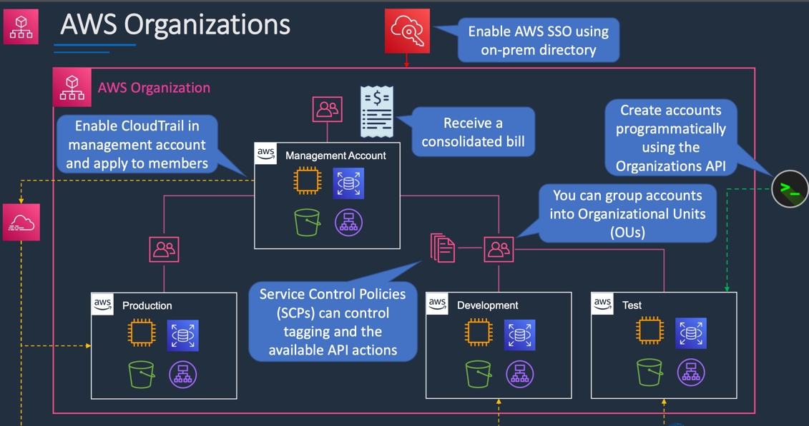

# aws accounts and organizations
## organizations

AWS Organizations 是亚马逊网络服务（AWS）提供的一项服务，旨在帮助企业管理多个AWS账户。通过AWS Organizations，用户可以集中管理账户的访问权限、管理策略和费用，并能够实现成本优化和安全性增强。以下是有关AWS Organizations的详细信息：

### 1. **基本概念**
- **组织（Organization）**：一个AWS Organizations中的顶层结构，一个组织可以包含多个账户。
- **账户（Account）**：AWS的基本计费单位，每个账户都有独立的资源和计费信息。
- **组织单位（Organizational Units, OU）**：用于将账户分组，以便对多个账户进行管理。OU可以嵌套，允许更灵活的组织结构。

### 2. **功能和优势**
- **集中管理**：通过中央控制台可以管理所有成员账户，简化了账户的创建、删除和管理。
- **策略管理**：可以使用服务控制策略（Service Control Policies, SCPs）限制账户中的服务和资源使用，从而增强安全性和合规性。
- **成本管理**：可以查看各个账户的费用，进行成本分配和滚动汇总，有助于优化预算。
- **跨账户访问**：支持角色和权限的设置，允许在组织内部的账户之间轻松访问资源。

### 3. **服务控制策略 (SCPs)**
- SCPs 是一种组织级别的策略，能够控制各个账户可以访问的AWS服务和API操作。可以将SCP应用于整个组织，或特定的OU或账户。
- SCP非常强大，因为它们可以限制账户的服务使用范围，帮助企业遵循合规要求。

### 4. **创建和管理组织**
- **创建组织**：可以通过AWS Management Console、AWS CLI或者AWS SDK来创建AWS Organizations。创建组织时，您可以选择现有账户作为管理账户（Master Account）。
- **邀请账户**：可以邀请现有的AWS账户加入组织，或者直接在组织中创建新的子账户。
- **管理OU和账户**：可以创建不同的OU，将账户分组，并应用不同的SCP以满足不同部门或项目的需求。

### 5. **审计和合规性**
- AWS Organizations提供跨账户审核功能，用户可以使用AWS CloudTrail等工具跟踪和记录所有账户的活动，确保符合组织的审计要求。

### 6. **使用场景**
- **大型企业**：多部门协作，每个部门有独立的预算和服务使用需求。
- **费用优化**：根据不同项目或部门对服务的使用情况，做出更好的预算调整。

### 7. **安全性**
- 通过SCP管理访问权限，强化了对资源的保护。同时，AWS Identity and Access Management (IAM) 结合AWS Organizations可以实现更精细的权限控制。

### 总结
AWS Organizations是管理复杂云环境的强大工具，通过集中管理多个AWS账户，它提供了丰富的功能来帮助企业降低管理成本、提高效率，并增强安全性。无论是通过服务控制策略、组织单位的灵活性，还是成本管理的便利性，AWS Organizations都能帮助企业更高效地使用云服务。