# Identity Management and Permissions
## IAM 是怎么工作的
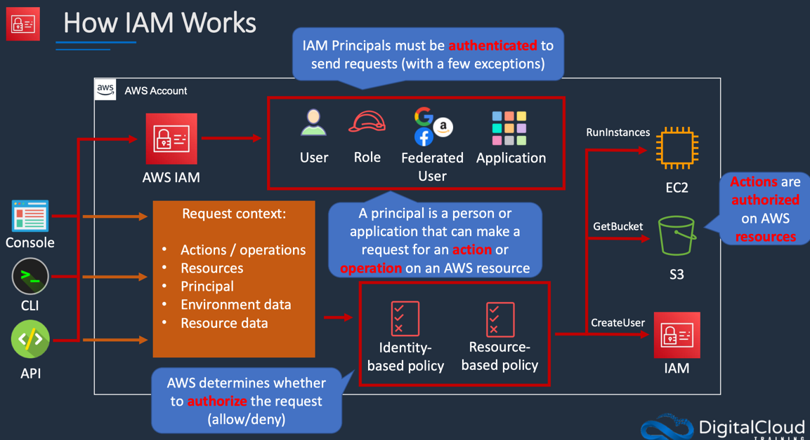

AWS Identity and Access Management（IAM）是亚马逊云服务（AWS）的一项关键功能，用于安全地控制对AWS资源的访问。IAM允许用户创建和管理权限，确保只有经过授权的用户和服务才能访问特定资源。以下是AWS IAM的工作原理及其关键组件和概念。

### 1. **基本概念**
- **用户（User）**：IAM用户代表在AWS中有身份的个体或服务。每个用户都有唯一的身份凭证，包括访问密钥和密码。
- **组（Group）**：用户组用于将一组用户组织在一起，以简化权限管理。可以向组中分配权限，然后这些权限将自动应用于组内的所有用户。
- **角色（Role）**：IAM角色是指AWS服务或其他AWS账户可以扮演的身份。角色定义了一组权限，但不与特定用户相关联，常用于跨账户访问或临时访问。
- **策略（Policy）**：策略是以JSON格式定义的权限集合，指定了用户、组或角色可以执行的操作和对哪些资源的访问。策略可以是托管策略（AWS提供的）或自定义策略。

### 2. **身份验证与授权**
- **身份验证**：IAM的第一步是确认用户身份。用户通过AWS管理控制台、AWS CLI或API使用其凭证（如用户名和密码或访问密钥）进行身份验证。
- **授权**：一旦身份验证成功，IAM会根据与用户、组或角色关联的策略来确定该用户是否有权访问请求的资源。IAM使用显式允许和显式拒绝的原则来做出决策：如果策略明确允许用户执行特定操作，则允许访问；如果策略明确拒绝，则拒绝访问。如果没有相关策略，则默认拒绝。

### 3. **IAM政策的结构**
IAM策略由以下几个部分组成：
- **版本（Version）**：策略的版本信息（通常为2012-10-17）。
- **声明（Statement）**：定义权限的主要部分，包含多个参数：
    - **Effect**：指示策略的效果，是允许（Allow）还是拒绝（Deny）。
    - **Action**：指定允许或拒绝的操作，例如`ec2:StartInstances`。
    - **Resource**：指定操作可以访问的资源。例如，特定的EC2实例ARN（Amazon Resource Name）。
    - **Condition**：可选的条件语句，进一步限制策略的使用，例如基于请求的IP地址或时间。

### 4. **多重身份验证（MFA）**
为了增强安全性，IAM支持多重身份验证（MFA）。用户在使用其凭证登录时，除了输入密码外，还需要提供一个基于时间的一次性密码（TOTP）或硬件设备生成的代码。MFA增加了一个额外的安全层次，防止未授权访问。

### 5. **审计与监控**
AWS CloudTrail服务允许用户记录和查看对AWS资源的API调用，提供可审计的管理信息。结合IAM，CloudTrail可以帮助跟踪用户行为、权限更改和策略使用情况，有助于安全审计和合规性检查。

### 6. **最佳实践**
- **按需最小权限原则**：只授予用户所需的最低权限，避免超出必要的访问。
- **使用组和角色**：为组和角色分配权限，而不是直接为每个用户分配权限，以简化管理。
- **启用多重身份验证**：对所有用户启用MFA，特别是具有管理员权限的用户。
- **定期审查权限**：定期检查和更新IAM策略和权限，确保它们仍然符合当前业务需求。

## Users, Groups, Roles and Policies
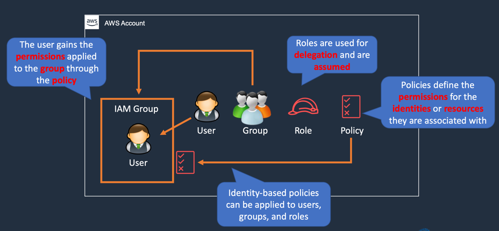
- 用户（User）
   用户是AWS中用于标识个体或服务的身份。每个用户都有自己的凭证（如访问密钥和密码），用于登录AWS管理控制台或访问AWS API。用户可以获得相应的权限，以执行特定操作。

- 组（Group）
   IAM组是一个用户的集合，允许您将多个用户组织在一起。您可以向组中添加多个用户，以便对其进行统一管理。例如，您可以创建一个名为“开发人员”的组，将所有开发人员用户添加到该组中。组本身不会有直接的身份凭证，它只是一个管理结构。
- 策略（Policy）
  策略是以JSON格式定义的权限集合。它定义了用户、组或角色可以执行的操作以及可以访问的资源。例如，一个策略可以允许访问特定的S3桶或启动EC2实例。我们可以将Policy应用到我门的iam group, user 通过 应用在 iam group 中的policy 获得权限
  因为policy 中定义了 一组权限，这个policy 应用到iam group中，用户位于iam group中，因此用户获得 policy 中定义的权限，这就是所谓的 “基于身份的策略”， 因为他应用于身份上（user 是一个身份）。总知：将策略应用到组时，组中的所有用户都会继承这些权限。

## IAM Users
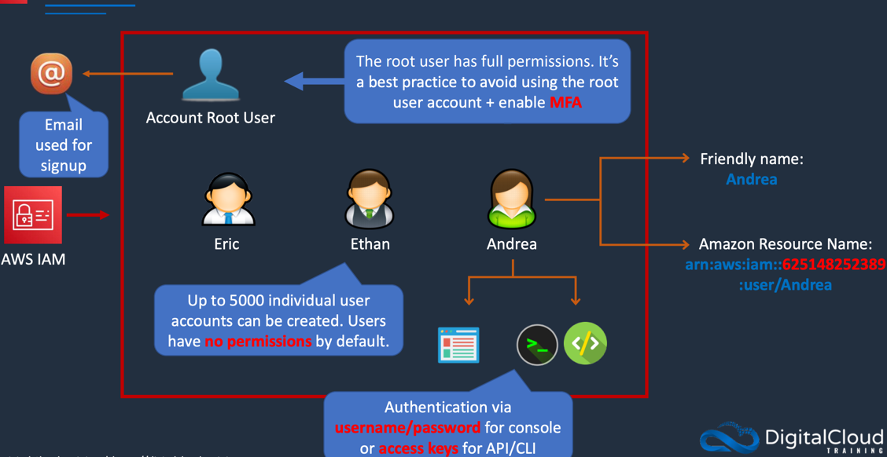


## IAM Groups
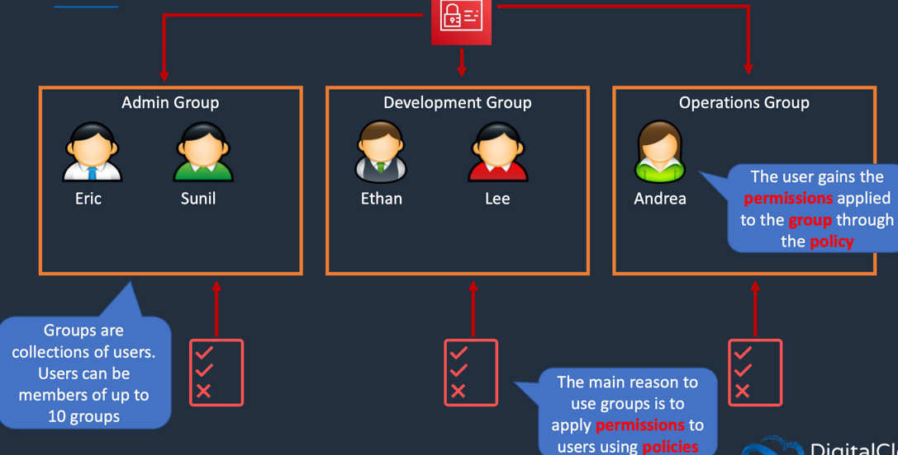


## IAM Roles 
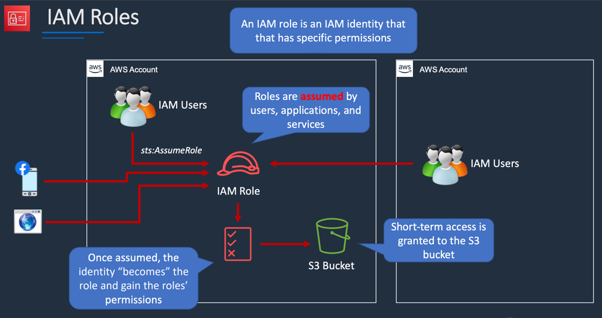

### 角色的定义与特点

1. **角色（Role）**：
    - 角色是具备特定权限的身份，它不是一个与特定用户绑定的长期身份。相反，角色可以被多个用户、应用程序或AWS服务实例假设（assume）。
    - 角色的设计目的是委托访问，让其他实体（用户、服务或应用程序）临时担任该角色，并获得该角色的权限。

2. **权限的指定**：
    - 角色的权限通过**IAM策略**（Policy）来定义，这些策略以JSON格式描述允许或拒绝的AWS操作。
    - 当角色被创建时，可以将一个或多个策略附加到该角色上，从而定义该角色可以访问哪些AWS资源以及可以执行哪些操作。

### 角色的工作原理

1. **角色的创建与策略关联**：
    - 在AWS管理控制台或通过AWS CLI，您可以创建一个角色，并为其附加一个或多个IAM策略。这些策略定义了角色可以执行的操作和可以访问的资源。

2. **角色的承担（Assuming a Role）**：
    - 当用户、服务或应用程序需要执行角色允许的操作时，它们可以“假设”该角色。假设角色的过程是一个临时的身份转移，允许实体按照角色的权限行事。
    - 通过调用AWS STS（Security Token Service）的AssumeRole API，实体可以获取临时的安全凭证。这些凭证是有限时效的，并且与被假设的角色关联。

3. **访问AWS资源**：
    - 一旦成功假设角色，实体将获得与角色相关联的权限。这意味着，假设角色的用户或服务可以按照角色的权限去访问、管理AWS资源，如S3桶、EC2实例等。

### 使用场景示例

1. **EC2实例角色**：
    - 您可以创建一个EC2实例角色，授予其对S3桶的访问权限。当EC2实例启动时，它可以假设这个角色，从而能够上传或下载S3桶中的对象，而不需要在实例配置中存储访问密钥。

2. **跨账户访问**：
    - 通过角色实现跨AWS账户访问。您可以在一个AWS账户中创建角色，并授权其他账户中的用户假设该角色，从而访问本账户的特定资源。

3. **临时访问**：
    - 对于一些需要临时访问权限的场景，角色非常有效。公司可以为外部合作者或临时员工创建角色，授予他们在特定时间段内对资源的访问权限。

### 角色与策略的关系

- **策略的运用**：
    - IAM策略可以附加到角色上，定义其可以执行的操作。每当通过假设角色获得凭证时，这些策略将被检查以确定可以执行哪些操作。
    - 策略可以包括条件语句，以进一步限制角色的权限，例如，仅在特定条件（如特定IP范围内）下允许访问。

### 总结

AWS IAM中的角色是强大的安全和权限管理工具，通过角色的假设，用户和服务可以临时获得特定权限，方便而安全地访问AWS资源。通过结合策略，角色为各种应用场景提供灵活的权限控制，帮助企业实现最佳实践与安全合规。

## IAM Policies
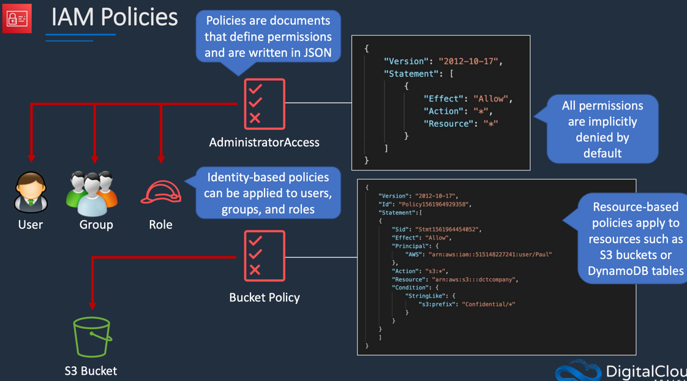
在AWS IAM中，策略（Policy）主要分为两种类型：**基于身份的策略（Identity-based Policies)** 和 **基于资源的策略（Resource-based Policies）**。下面是对这两种类型策略的详细解释。

### 1. 基于身份的策略（Identity-based Policies）

- **定义**：基于身份的策略是附加到用户、组或角色上的策略。这种策略定义了与这些身份相关联的权限，即这些身份可以执行哪些操作以及可以访问哪些资源。

- **适用对象**：这些策略适用于IAM用户、IAM组和IAM角色。例如，您可以为一个IAM用户添加策略，使其能够访问特定的S3桶或启动EC2实例。

- **策略的结构**：
    - **版本（Version）**：策略的版本信息，通常为`2012-10-17`。
    - **声明（Statement）**：描述权限的主要部分，包括：
        - **Effect**：可以是`Allow`（允许）或`Deny`（拒绝）。
        - **Action**：指定允许或拒绝的操作，如`ec2:StartInstances`。
        - **Resource**：指定可以访问的资源，例如特定S3桶的ARN（Amazon Resource Name）。
        - **Condition**（可选）：进一步限制策略的条件，比如基于IP地址、时间等。

- **示例**：如果您有一个开发团队，您可以创建一个IAM组，并为该组附加一个基于身份的策略，允许组内的所有成员访问特定的数据库。

### 2. 基于资源的策略（Resource-based Policies）

- **定义**：基于资源的策略是直接附加在AWS资源上的策略，它定义了允许对该资源执行哪些操作的条件。这类策略通常用于共享资源给其他AWS账户或用户。

- **适用对象**：这种策略通常用于特定的AWS资源，如S3桶、SQS队列、Lambda函数等。通过基于资源的策略，您可以允许不同账户或IAM用户访问该资源。

- **策略的结构**：
    - 结构上类似于基于身份的策略，包含版本、声明、操作、资源和条件等。
    - 不同的是，基于资源的策略直接附加到资源上，并明确指定谁可以访问该资源。

- **示例**：您可以在一个S3桶上附加一个基于资源的策略，允许特定的IAM用户或AWS账户访问该桶，或者允许所有AWS账户进行只读访问。

### 3. 权限评估

在AWS中，权限是由多个因素共同决定的，权限评估遵循以下原则：
- **显式拒绝优先**：如果有任何策略明确拒绝某个操作，该操作将被拒绝，无论其他策略如何。
- **隐式拒绝**：如果没有任何策略允许相应操作，则默认情况下该操作将被拒绝。
- **允许**：只有在有适当的允许策略时，操作才会被允许。

### 4. 使用场景

- **基于身份的策略**：
    - 用于管理用户、组或角色的权限。
    - 适用于组织内部权限管理的角色分配。

- **基于资源的策略**：
    - 用于跨账户或跨组织共享AWS资源。
    - 适用于在多账户环境中管理资源访问控制。

### 总结

AWS IAM中的策略是管理访问权限的核心工具，基于身份的策略和基于资源的策略各自适用于不同的场景。通过这两种策略的结合，AWS能够实现灵活的权限管理和安全控制，使企业在云环境中实现最佳实践和安全合规。


##  AWS Security Token Service (STS)
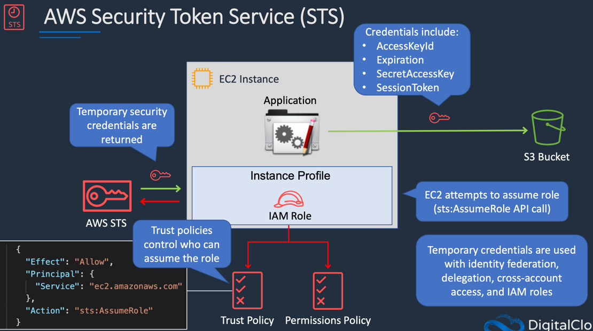
AWS Security Token Service (STS) 是一个允许用户请求临时安全凭证的服务。STS 提供了一种机制，使用户能够获取短期的、可用于访问 AWS 资源的凭证。理解 STS 的工作原理和应用场景对 AWS 的安全管理至关重要。

### 1. **STS 的基本概念**

- **临时凭证**：STS 主要提供短期的安全凭证。与长期凭证（例如 IAM 用户的访问密钥）不同，临时凭证有有效期，并在过期后需要重新获取。

- **凭证组成**：STS 返回的临时安全凭证通常包括以下内容：
    - **访问密钥（Access Key）**：用于标识和认证请求的凭证。
    - **秘密访问密钥（Secret Access Key）**：用于签名请求的凭证。
    - **会话令牌（Session Token）**：附加的令牌，提供额外的安全性检查。
    - **有效期**：临时凭证通常有1小时至12小时的有效期，超过这个时间，需要重新获取凭证。

### 2. **STS 的工作原理**

当一个 EC2 实例（运行某个应用程序）需要访问 S3 桶时，以下是 STS 的工作流程：

- **实例配置**：首先，可以为 EC2 实例创建一个实例配置（Instance Profile），并将 IAM 角色附加到该配置上。这个角色定义了允许 EC2 实例执行的操作。

- **角色假设**：EC2 实例会通过调用 `sts:AssumeRole` API 请求假设该角色。这个过程涉及到请求临时凭证，以便能够执行在该角色的权限范围内的操作。

- **信任策略**：在 IAM 角色中有两种主要的策略：
    - **权限策略（Permissions Policy）**：定义了被允许或拒绝的操作。
    - **信任策略（Trust Policy）**：控制谁可以假设该角色。比如，可以设置信任策略，以允许 `ec2.amazonaws.com` 服务假设角色。

- **凭证获取**：一旦 EC2 实例成功假设角色，STS 会返回临时安全凭证，EC2 实例便可以使用这些凭证访问 S3 桶。

### 3. **临时凭证的自动管理**

- **过期处理**：临时凭证在有效期过后将失效。AWS SDK 和 CLI 通常能够自动处理凭证的续期，这意味着如果您将应用程序配置为使用临时凭证，它们会自动请求新的凭证，而无需人工干预。

### 4. **STS 的使用场景**

临时凭证在多个安全场景中非常有用，包括：
- **身份联合（Identity Federation）**：允许现有身份提供商的用户访问 AWS 资源。
- **委托访问（Delegation）**：允许用户将其访问权限委托给其他用户或组织。
- **跨账户访问（Cross-Account Access）**：允许来自其他 AWS 账户的用户访问本账户中的资源。
- **IAM 角色**：为不同的 AWS 服务（如 EC2、Lambda）提供必要的访问权限。

### 5. **总结**

AWS Security Token Service (STS) 是管理临时凭证的关键工具，使得用户可以安全地访问 AWS 资源。通过使用 STS，您可以容易地实现访问控制、身份联合、跨账户访问等场景，同时增强系统的安全性。理解和有效利用 STS 是云计算环境中实现安全管理的基础。

##  Identity-Based Policies and Resource-Based Policies

在 AWS IAM 中，Identity-Based Policies（基于身份的策略）和 Resource-Based Policies（基于资源的策略）是两种控制访问权限的策略，它们各自有不同的应用场景和用途。以下是对这两种策略的详细讲解。

### 1. Identity-Based Policies（基于身份的策略）
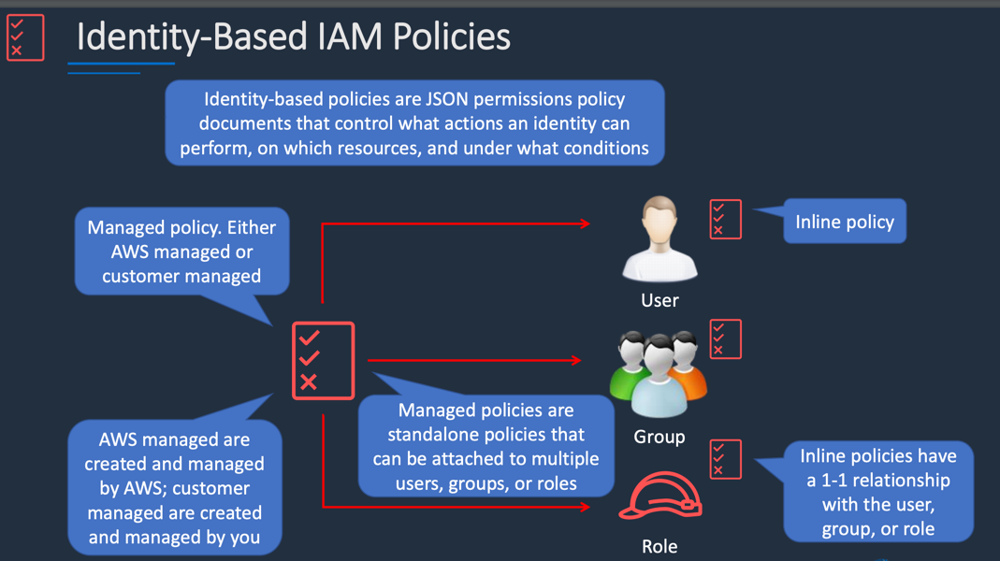
#### 定义
基于身份的策略是一种 JSON 格式的权限策略文档，控制与特定身份（用户、组或角色）关联的权限。这种策略主要定义了身份可以在特定条件下对资源执行的操作。

#### 适用对象
- **IAM 用户**：一个具体的 AWS 账户用户。
- **IAM 组**：多个用户的集合，便于统一管理。
- **IAM 角色**：允许 AWS 服务或其他 AWS 账户假设的身份。

#### 策略类型
- **内联策略（Inline Policy）**：
    - 每个内联策略与一个特定的用户、组或角色有一对一的关系。
    - 内联策略不能被共享或重用，一旦删除相关联的身份，内联策略也会被删除。

- **托管策略（Managed Policies）**：
    - 分为 AWS 托管策略和客户托管策略。
    - **AWS 托管策略**：由 AWS 创建和管理，用户无法修改这些策略，但可以在自己的账户中使用。
    - **客户托管策略**：由用户自定义创建和管理，可以根据需要进行修改。
    - 托管策略可以被多个用户、组和角色共享，支持更灵活的权限管理。

### 2. Resource-Based Policies（基于资源的策略）
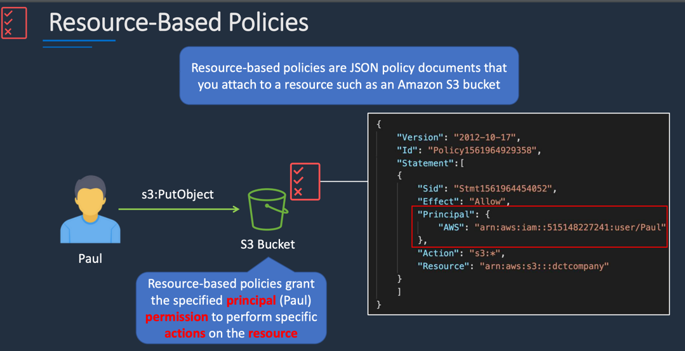
#### 定义
基于资源的策略是直接附加在 AWS 资源上的策略文档，用于定义哪些身份（用户、组、角色）可以对该资源执行哪些操作。这种策略允许跨账户访问和单独资源访问权限控制。

#### 适用对象
- 资源类型包括但不限于 S3 桶、DynamoDB 表、SQS 队列等。

#### 策略结构
基于资源的策略通常包括以下内容：
- **Effect**：可以是 `Allow` 或 `Deny`。
- **Principal**：指定可以访问该资源的身份（如用户、角色或其他 AWS 服务）。
- **Action**：允许或否决的特定 API 操作（例如，`s3:PutObject` 或 `s3:*` 表示所有 S3 操作）。
- **Resource**：指定可访问的资源 ARN。

#### 使用示例
假设有一个 S3 桶和一个用户 Paul。你可以为 S3 桶附加一个基于资源的策略，允许 Paul 在该桶中执行操作。策略可能如下所示：
```json
{
  "Version": "2012-10-17",
  "Statement": [
    {
      "Effect": "Allow",
      "Principal": {
        "AWS": "arn:aws:iam::account-id:user/Paul"
      },
      "Action": "s3:*",
      "Resource": "arn:aws:s3:::example-bucket"
    }
  ]
}
```
这表示 Paul 可以在 `example-bucket` 桶上执行所有 S3 操作。

### 3. Trust Policy 和 Permissions Policy!
[img_9.png](img/img_9.png)
在 IAM 角色中，存在两种策略类型：
- **信任策略（Trust Policy）**：它是一种特殊类型的基于资源的策略，用于控制哪个身份可以假设该角色。定义符合条件的实体（如 EC2 实例）可以获取角色的权限。

- **权限策略（Permissions Policy）**：基于身份的策略，定义了角色被假设后的权限。

### 4. 访问权限评估
在权限评估过程中，基于身份的策略和基于资源的策略可以共同作用，AWS 会基于以下原则进行评估：
- **显式拒绝优先**：如果有拒绝（Deny）声明，则相关操作将被拒绝。
- **隐式拒绝**：如果没有允许的策略，操作将被默认拒绝。
- **允许**：只有在有允许的策略时，操作才会被允许。

### 5. 总结
基于身份的策略和基于资源的策略是 AWS 权限管理的核心部分。基于身份的策略主要用于定义用户、组和角色的权限，而基于资源的策略则用于管理对具体资源的访问权限。结合使用这两种策略可以实现灵活、安全的权限控制，适应多种业务需求。

## Access Control Methods - RBAC & ABAC
访问控制是保护计算资源的重要组成部分，特别是在云环境中。RBAC（基于角色的访问控制）和 ABAC（基于属性的访问控制）是 AWS 和其他云服务中常用的两种方法。下面我将详细讲解这两种方法的概念、工作原理、优缺点及其实现过程。

### 1. 角色基于访问控制（RBAC）

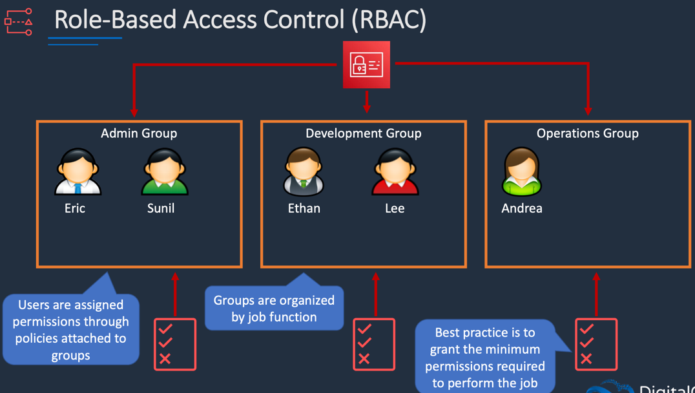
#### 定义
RBAC（Role-Based Access Control）是一种通过角色来管理访问权限的方法。用户被分配到不同的角色，这些角色包涵了一组权限，角色的设计通常基于组织内的职位或职能。

#### 核心概念
- **角色（Role）**：例如，管理员角色、开发人员角色、运维角色等。每个角色都有特定的权限，这些权限决定了用户可以执行的操作。
- **用户（User）**：可以是组织内的员工，如工程师、管理员等。用户通过其所属角色获得权限。
- **权限（Permission）**：允许执行特定操作的规则，通常涉及到访问数据或执行系统操作。

#### 工作原理
1. 定义不同角色及其权限。将相应的权限策略应用到各个角色上。
2. 将用户分配到适当的角色中。例如，开发人员可能被分配到开发角色，而运维人员被分配到运维角色。
3. 当用户尝试访问资源时，系统根据用户所处的角色来判断其权限。

#### 示例
假设我们有三组：管理员组、开发组和运维组。
- **运维组**中的用户 安德里亚（Andrea）被授予访问运维相关资源的权限。
- **开发组**中的用户 李（Lee）获得开发所需的权限。
- 由于角色的设置，安德里亚不能访问开发组的资源，反之亦然。

这种方法遵循最小权限原则，即用户只获得完成其工作所需的最少权限。

#### 优点
- **简化管理**：通过角色简化了权限分配过程，易于控制和审核。
- **安全性**：确保用户的权限仅限于其工作职责。
- **易于审计**：实现了清晰的权限结构，便于监控和合规性审查。

#### 缺点
- **灵活性不足**：不适合需要复杂、动态的访问控制的场景。
- **角色管理的复杂性**：随着组织规模的扩大，角色的数量可能迅速增加，管理起来会很麻烦。

### 2. 属性基于访问控制（ABAC）
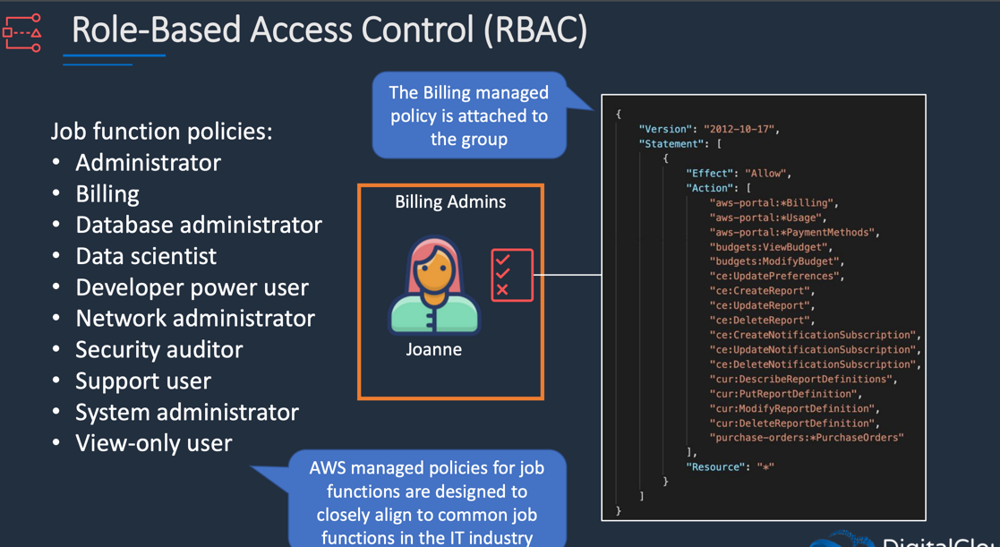
#### 定义
ABAC（Attribute-Based Access Control）是一种通过评估用户、资源和环境的属性来管理访问权限的模型。属性是一些元数据，可以是关键值对。

#### 核心概念
- **用户属性**：例如，部门、角色、用户身份等。
- **资源属性**：资源的标签，如服务器类型、安全级别等。
- **环境属性**：与访问请求时的环境相关的特征，如时间、地点等。

#### 工作原理
在 ABAC 中，访问权限是动态评估的，且基于一些特定的条件。例如，可以根据用户属性和资源属性的匹配关系来决定访问权限。

#### 示例
假设我们有一个数据库管理员组（DBAdmins），其中包含成员戴夫（Dave）：
- 戴夫的用户上被标记为 `department: DBAdmins`。
- 角色权限策略允许他执行一些数据库操作，如重启实例、启动实例和停止实例。

策略的 JSON 示例：
```json
{
  "Effect": "Allow",
  "Action": [
    "rds:RebootDBInstance",
    "rds:StartDBInstance",
    "rds:StopDBInstance"
  ],
  "Resource": "*",
  "Condition": {
    "StringEquals": {
      "aws:PrincipalTag/department": "DBAdmins",
      "rds:ResourceTag/environment": "production"
    }
  }
}
```
当戴夫尝试重启一个标记为生产环境的数据库实例时，因其用户标签 `department` 为 `DBAdmins`，且数据库的标签 `environment` 为 `production`，因此访问成功。然而，如果他尝试停止一个开发环境的数据库实例，则由于该环境不匹配，访问请求会被拒绝。

#### 优点
- **灵活性**：能够实现非常细粒度的访问控制，适应复杂的业务需求。
- **减少角色数量**：无需为每个权限组创建大量角色，简化管理。
- **实时性**：可以动态响应业务和环境变化。

#### 缺点
- **复杂性**：策略的定义和管理可能变得复杂，尤其在资源和用户属性增多时。
- **性能影响**：每个访问请求都需要进行属性评估，可能影响性能。

### 3. 选择合适的访问控制模型
选择 RBAC 还是 ABAC 取决于组织的安全需求、规模和IT环境的复杂性：
- **RBAC 更适合的场景**：
    - 结构固定，角色明确定义。
    - 用户数量大而权限复杂度低。

- **ABAC 更适合的场景**：
    - 需要灵活的条件和动态的权限上下文。
    - 资源属性多且复杂的环境。

### 4. 总结
RBAC 和 ABAC 各有优势和不足，选择合适的模型能够有效提升组织的访问安全性和管理效率。RBAC通过角色简化管理，而ABAC通过属性评估提供灵活性，两者可以结合使用，以满足不同的安全需求和业务场景。

## Permissions Boundaries
### Permissions Boundaries（权限边界）

权限边界是 AWS IAM 的一种重要工具，用于控制用户所能获得的最大权限。它们用于防止用户权限的滥用和特权升级，确保用户在进行操作时不会超出预设的权限范围。以下是对权限边界的详细解释，包括概念、使用场景、工作原理以及代码示例。

### 1. 权限边界的定义

权限边界是一个权限策略，指定了某个 IAM 用户或角色能够使用的最大权限。虽然用户可以拥有多个权限策略，但是权限边界用来限制用户可以执行的操作。

### 2. 权限边界的功能

- **最大权限控制**：权限边界确定了用户或角色能够执行的操作范围，即使权限策略授予了更宽泛的权限，用户也不能超出权限边界。
- **防止特权升级**：通过设置权限边界，可以阻止用户创建新的 IAM 用户和角色，并赋予其超出自己权限的能力，避免潜在的安全风险。

### 3. 权限边界的工作原理
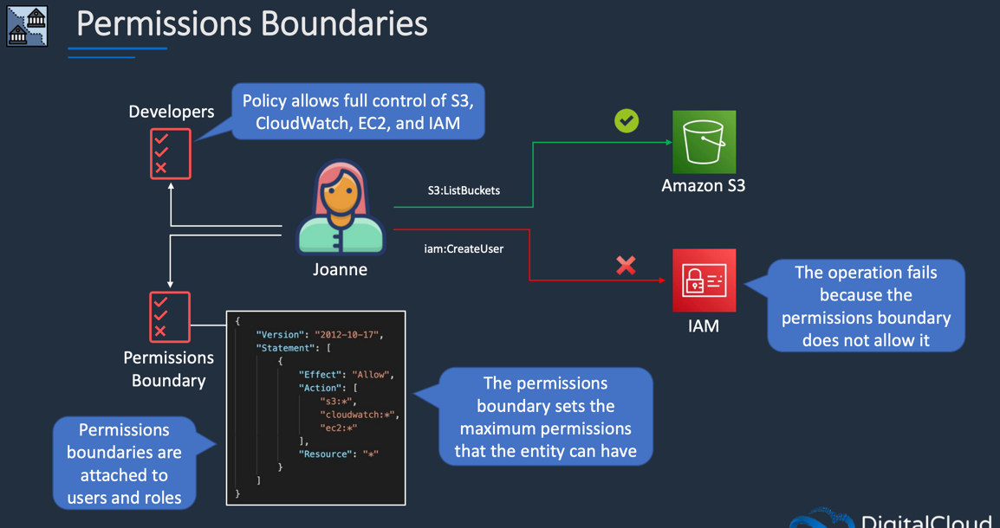
#### 示例场景

考虑以下两个用户的例子：**Joanne** 和 **Lindsay**。

1. **Joanne 的情况**
    - **权限策略**：Joanne 被分配了一个开发者权限策略，允许对 S3、CloudWatch、EC2 和 IAM 的完全控制。
    - **权限边界**：一个权限边界策略允许所有 S3、CloudWatch 和 EC2 的操作。
    - **尝试操作**：
        - **列出 S3 桶**：她能够成功列出 S3 桶，因为她的权限策略允许此操作，并且权限边界也不限制她。
        - **创建 IAM 用户**：她尝试创建一个 IAM 用户，失败的原因是虽然她的权限策略允许此操作，但权限边界中并未包含对 IAM 的相关权限。

2. **Lindsay 的情况（特权升级）**
    - **权限策略**：Lindsay 被赋予 IAM 的完全访问权限，但是没有其他 AWS 资源的权限。
    - **特权升级**：她可以创建一个新用户（X 用户），并将管理员访问策略附加到该用户，这样她就可以通过新用户获得完全的管理权限。
    - **防止特权升级**：通过设置权限边界，可以确保这个新用户的权限不超过 Lindsay 的最大权限，因此即使 Lindsay 创建了用户 X，也不能赋予其更多的权限。
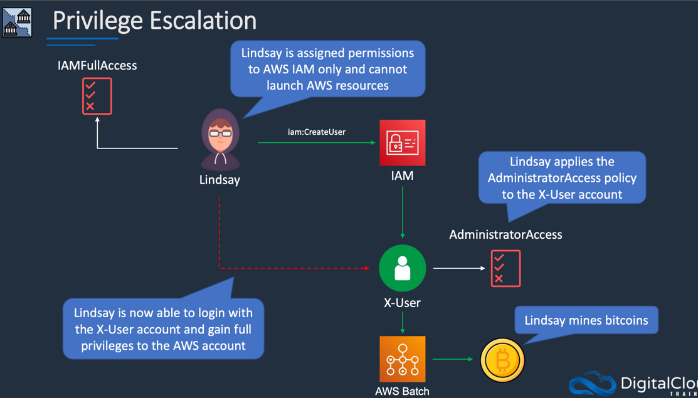

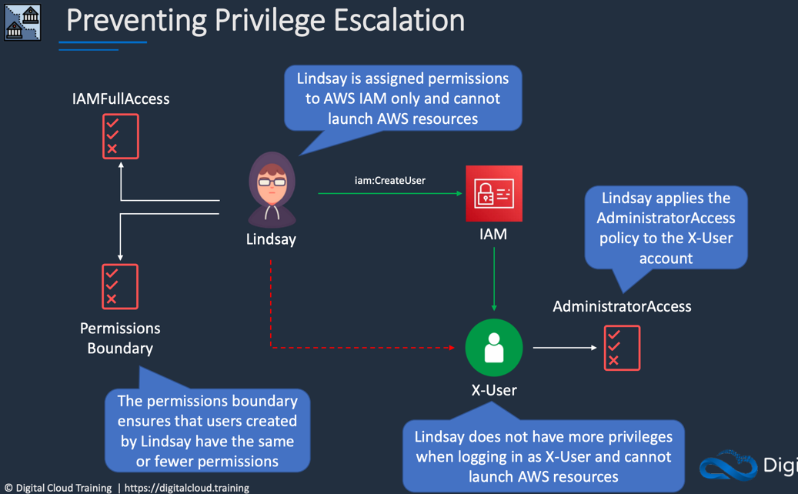
### 4. 权限边界的实现

权限边界是以权限策略的形式实现的，在为某个 IAM 用户或角色设置时，指定权限边界即可。例如，我们可以为每个用户设置一个权限边界，以确保用户创建的资源或用户不超过他们自己的权限。

#### 代码示例（JSON）

以下是一个可能的权限边界策略示例，限制用户只能在 S3 和 EC2 上执行特定操作：

```json
{
  "Version": "2012-10-17",
  "Statement": [
    {
      "Effect": "Allow",
      "Action": [
        "s3:*",
        "ec2:*"
      ],
      "Resource": "*"
    }
  ]
}
```

#### 设置权限边界

在 AWS 控制台或使用 CLI/API 设置权限边界：
1. 创建 IAM 策略，用于定义权限边界（如上所示）。
2. 在用户或角色的配置中，将此策略设置为权限边界。

### 5. 实用案例和最佳实践

- **特权用户控制**：为具有管理权限的用户设置权限边界，确保他们不能滥用权限。
- **遵循最小权限原则**：即使用户的权限策略允许更大的权限，其实际有效权限也受到限制。
- **分离权限管理**：在大公司中，可以制定和审批权限边界策略，并将其分配给用户或角色，确保责任分离。

### 6. 结论

权限边界是 AWS IAM 中的重要组成部分，提供了灵活的权限控制机制，可以有效防止特权升级与权限滥用。通过合理地设置权限边界，可以增强 AWS 资源的安全性，确保以最小权限原则进行资源管理。通过实际操作，可以更好地理解如何在组织中实施权限边界，并在适当的场景下有效地使用它们。

## IAM Policy Evaluation
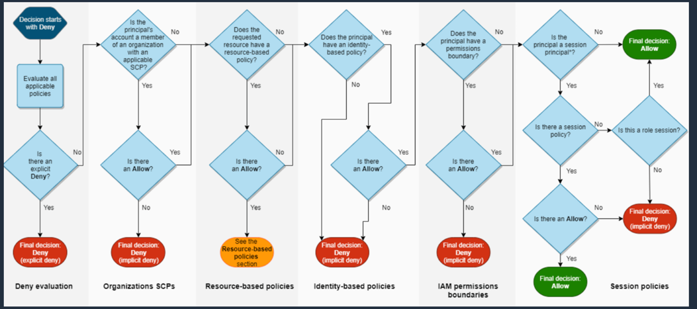